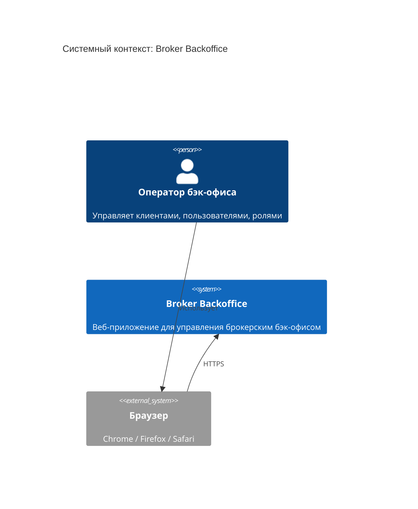
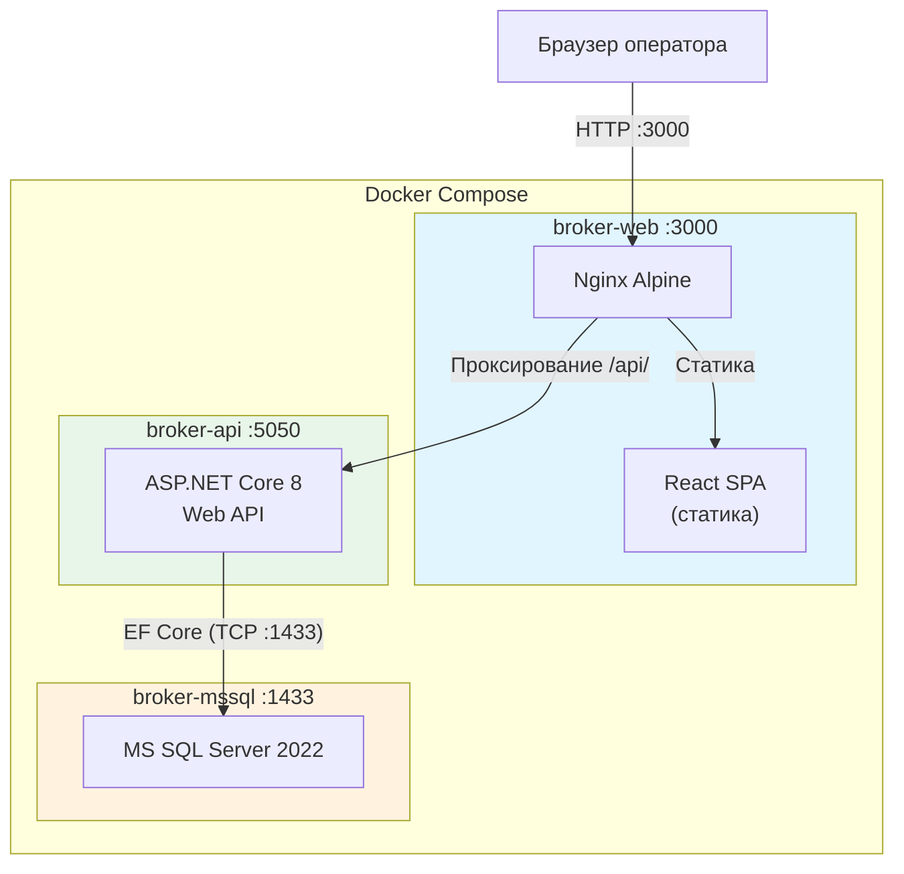
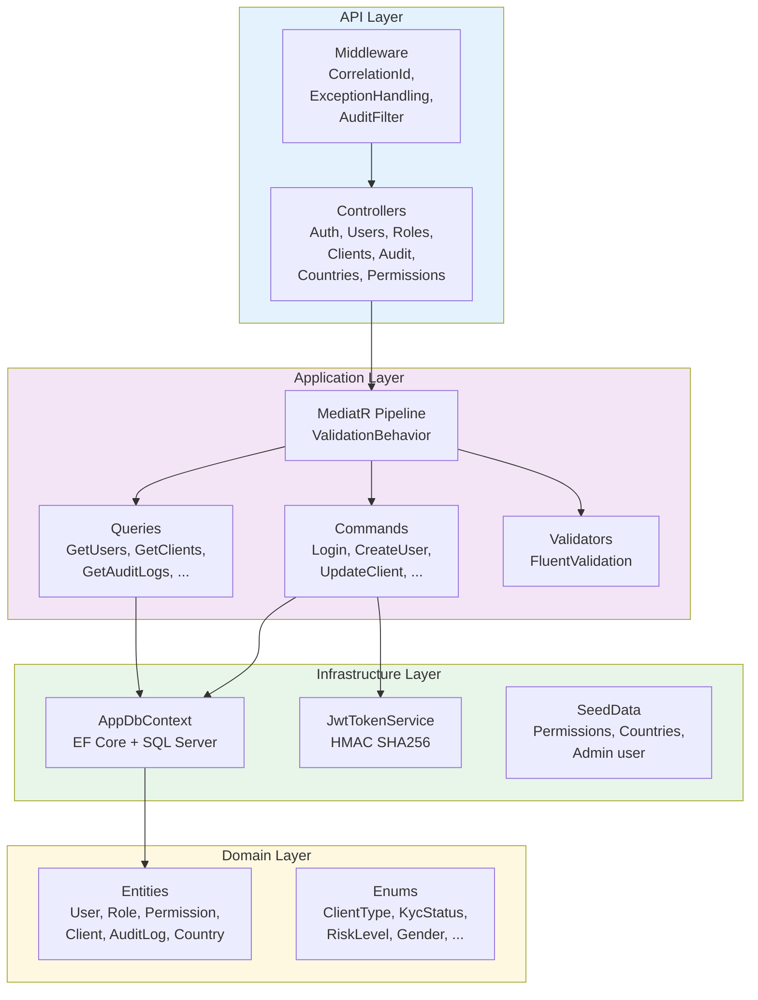
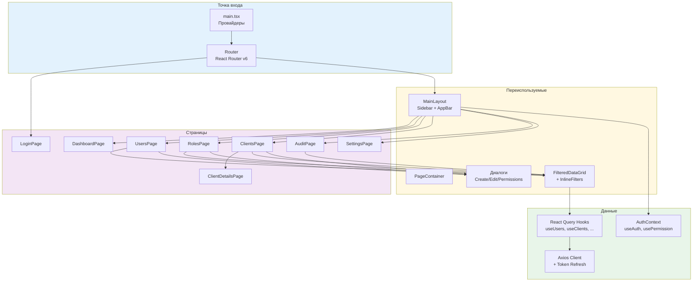

# 02. Системный контекст (C4-диаграммы)

## C4 Level 1 -- Контекст системы

> **Примечание:** Внешних интеграций (платежные системы, KYC-провайдеры, биржи) на данный момент не обнаружено. Система работает автономно.

## C4 Level 2 -- Контейнеры

### Сетевая карта

| Контейнер | Внешний порт | Внутренний порт | Протокол |
|-----------|-------------|-----------------|----------|
| broker-web | 3000 | 80 | HTTP (Nginx) |
| broker-api | 5050 | 8080 | HTTP (Kestrel) |
| broker-mssql | 1433 | 1433 | TDS (SQL) |

### Health Checks

| Контейнер | Механизм | Интервал |
|-----------|----------|----------|
| mssql | `sqlcmd SELECT 1` | 10s, 5 retries, start 30s |
| api | TCP check на порт 8080 | 10s, 5 retries, start 20s |
| web | `wget http://127.0.0.1:80/` | 10s, 3 retries, start 5s |

## C4 Level 3 -- Компоненты Backend

## C4 Level 3 -- Компоненты Frontend

