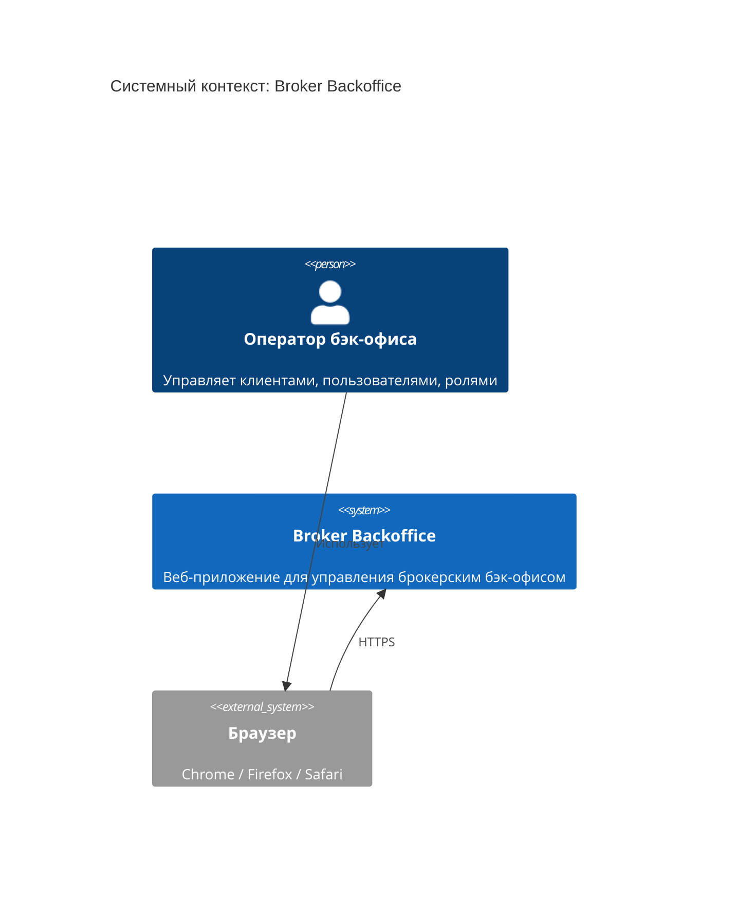
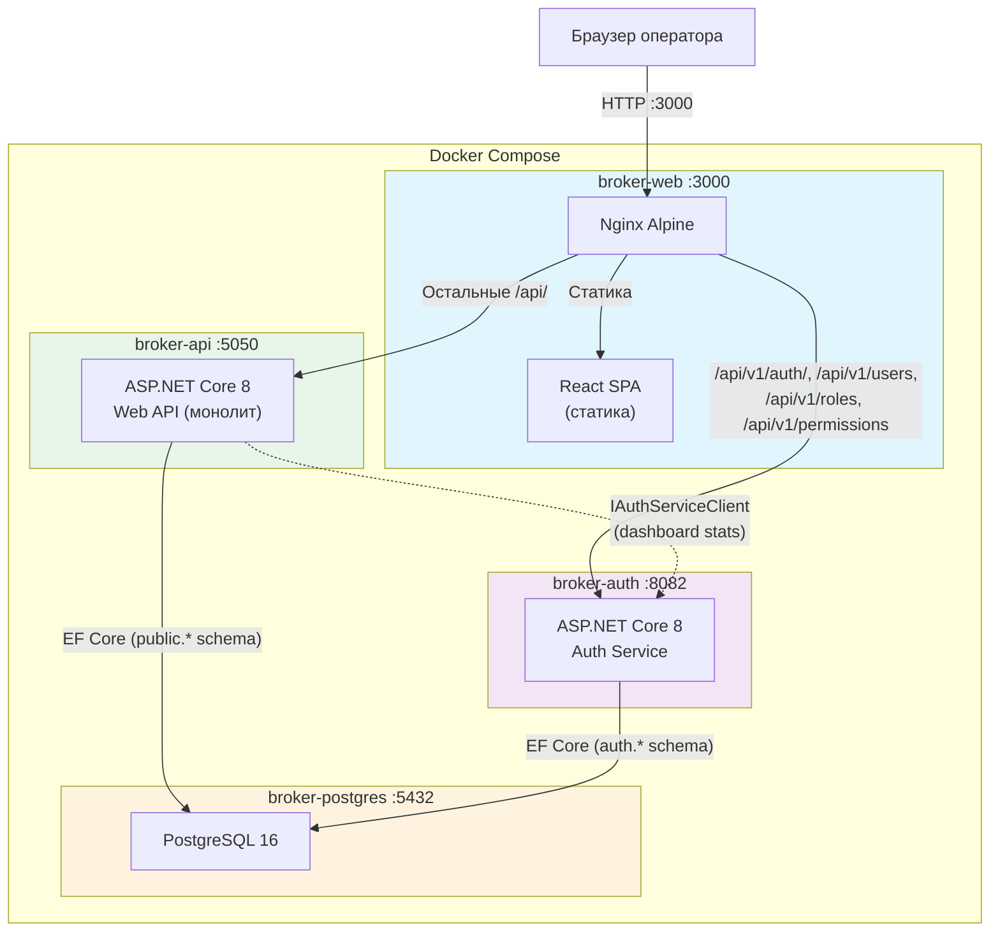
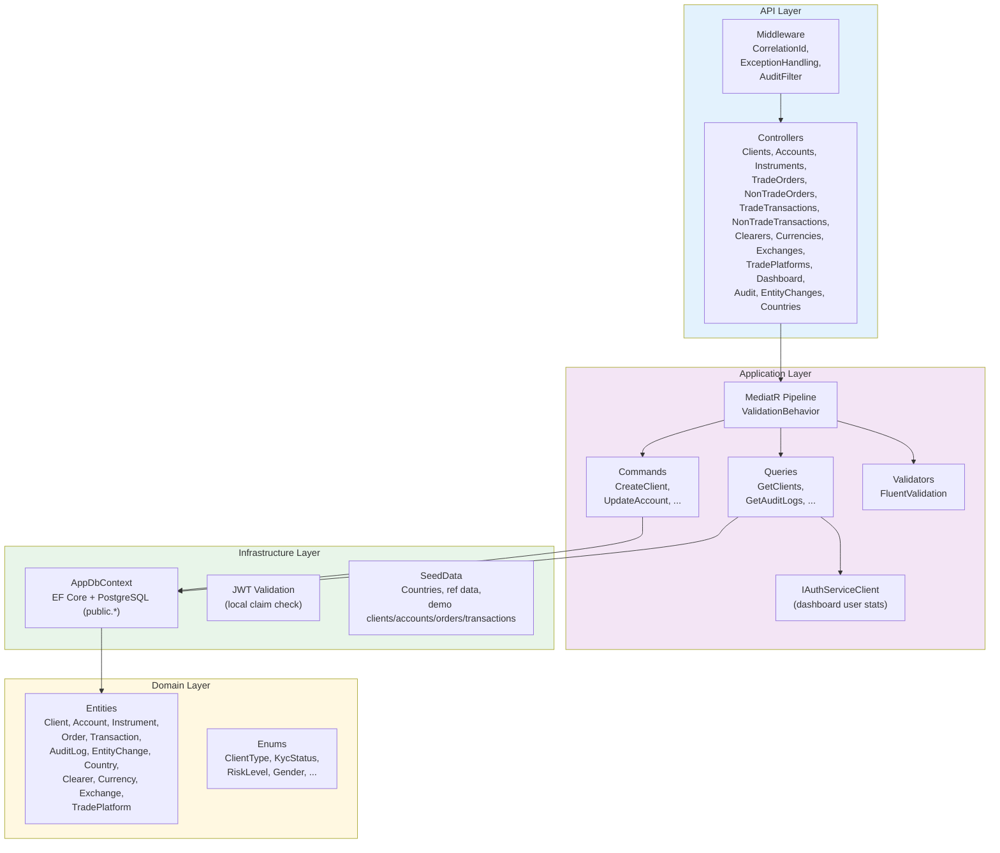
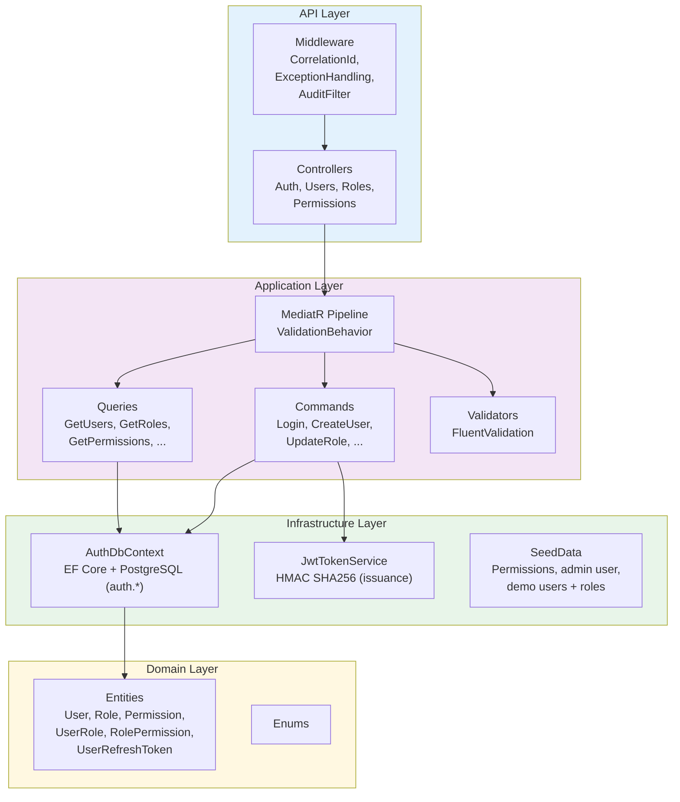
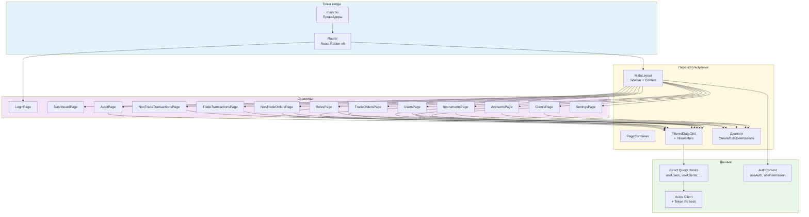

# 02. Системный контекст (C4-диаграммы)

## C4 Level 1 -- Контекст системы

```mermaid
C4Context
    title Системный контекст: Broker Backoffice

    Person(operator, "Оператор бэк-офиса", "Управляет клиентами, пользователями, ролями")
    System(backoffice, "Broker Backoffice", "Веб-приложение для управления брокерским бэк-офисом")
    System_Ext(browser, "Браузер", "Chrome / Firefox / Safari")

    Rel(operator, browser, "Использует")
    Rel(browser, backoffice, "HTTPS")
```

> **Примечание:** Внешних интеграций (платежные системы, KYC-провайдеры, биржи) на данный момент не обнаружено. Система работает автономно.

## C4 Level 2 -- Контейнеры

```mermaid
flowchart TB
    subgraph Docker["Docker Compose"]
        direction TB

        subgraph web["broker-web :3000"]
            nginx["Nginx Alpine"]
            spa["React SPA<br/>(статика)"]
        end

        subgraph auth["broker-auth :8082"]
            authsvc["ASP.NET Core 8<br/>Auth Service"]
        end

        subgraph api["broker-api :5050"]
            dotnet["ASP.NET Core 8<br/>Web API (монолит)"]
        end

        subgraph db["broker-postgres :5432"]
            postgres["PostgreSQL 16"]
        end
    end

    browser["Браузер оператора"] -->|"HTTP :3000"| nginx
    nginx -->|"Статика"| spa
    nginx -->|"/api/v1/auth/, /api/v1/users,<br/>/api/v1/roles, /api/v1/permissions"| authsvc
    nginx -->|"Остальные /api/"| dotnet
    dotnet -->|"EF Core (public.* schema)"| postgres
    authsvc -->|"EF Core (auth.* schema)"| postgres
    dotnet -.->|"IAuthServiceClient<br/>(dashboard stats)"| authsvc

    style web fill:#e1f5fe
    style auth fill:#f3e5f5
    style api fill:#e8f5e9
    style db fill:#fff3e0
```

### Сетевая карта

| Контейнер | Внешний порт | Внутренний порт | Протокол |
|-----------|-------------|-----------------|----------|
| broker-web | 3000 | 8080 | HTTP (Nginx, non-root) |
| broker-auth | 8082 | 8080 | HTTP (Kestrel) |
| broker-api | 5050 | 8080 | HTTP (Kestrel) |
| broker-postgres | 5432 | 5432 | TCP (PostgreSQL) |

### Nginx маршрутизация

| Путь | Backend |
|------|---------|
| `/api/v1/auth/`, `/api/v1/users`, `/api/v1/roles`, `/api/v1/permissions` | auth:8082 |
| Остальные `/api/` | api:8080 |
| `/`, `/assets/` | Статика SPA |

### Health Checks

| Контейнер | Механизм | Интервал |
|-----------|----------|----------|
| postgres | `pg_isready -U postgres` | 10s, 5 retries, start 10s |
| auth | TCP check на порт 8080 | 10s, 5 retries, start 20s |
| api | TCP check на порт 8080 | 10s, 5 retries, start 20s |
| web | `wget http://127.0.0.1:8080/` | 10s, 3 retries, start 5s |

## C4 Level 3 -- Компоненты Backend (монолит)

```mermaid
flowchart TB
    subgraph API["API Layer"]
        controllers["Controllers<br/>Clients, Accounts, Instruments,<br/>TradeOrders, NonTradeOrders,<br/>TradeTransactions, NonTradeTransactions,<br/>Clearers, Currencies, Exchanges,<br/>TradePlatforms, Dashboard,<br/>Audit, EntityChanges, Countries"]
        middleware["Middleware<br/>CorrelationId,<br/>ExceptionHandling,<br/>AuditFilter"]
    end

    subgraph App["Application Layer"]
        commands["Commands<br/>CreateClient,<br/>UpdateAccount, ..."]
        queries["Queries<br/>GetClients,<br/>GetAuditLogs, ..."]
        validators["Validators<br/>FluentValidation"]
        pipeline["MediatR Pipeline<br/>ValidationBehavior"]
        authClient["IAuthServiceClient<br/>(dashboard user stats)"]
    end

    subgraph Domain["Domain Layer"]
        entities["Entities<br/>Client, Account, Instrument,<br/>Order, Transaction,<br/>AuditLog, EntityChange, Country,<br/>Clearer, Currency, Exchange,<br/>TradePlatform"]
        enums["Enums<br/>ClientType, KycStatus,<br/>RiskLevel, Gender, ..."]
    end

    subgraph Infra["Infrastructure Layer"]
        dbcontext["AppDbContext<br/>EF Core + PostgreSQL (public.*)"]
        jwtValidation["JWT Validation<br/>(local claim check)"]
        seed["SeedData<br/>Countries, ref data,<br/>demo clients/accounts/orders/transactions"]
    end

    controllers --> pipeline
    pipeline --> validators
    pipeline --> commands
    pipeline --> queries
    commands --> dbcontext
    queries --> dbcontext
    queries --> authClient
    middleware --> controllers
    dbcontext --> entities

    style API fill:#e3f2fd
    style App fill:#f3e5f5
    style Domain fill:#fff8e1
    style Infra fill:#e8f5e9
```

## C4 Level 3 -- Компоненты Auth Service

```mermaid
flowchart TB
    subgraph API["API Layer"]
        controllers["Controllers<br/>Auth, Users, Roles,<br/>Permissions"]
        middleware["Middleware<br/>CorrelationId,<br/>ExceptionHandling,<br/>AuditFilter"]
    end

    subgraph App["Application Layer"]
        commands["Commands<br/>Login, CreateUser,<br/>UpdateRole, ..."]
        queries["Queries<br/>GetUsers, GetRoles,<br/>GetPermissions, ..."]
        validators["Validators<br/>FluentValidation"]
        pipeline["MediatR Pipeline<br/>ValidationBehavior"]
    end

    subgraph Domain["Domain Layer"]
        entities["Entities<br/>User, Role, Permission,<br/>UserRole, RolePermission,<br/>UserRefreshToken"]
        enums["Enums"]
    end

    subgraph Infra["Infrastructure Layer"]
        dbcontext["AuthDbContext<br/>EF Core + PostgreSQL (auth.*)"]
        jwt["JwtTokenService<br/>HMAC SHA256 (issuance)"]
        seed["SeedData<br/>Permissions, admin user,<br/>demo users + roles"]
    end

    controllers --> pipeline
    pipeline --> validators
    pipeline --> commands
    pipeline --> queries
    commands --> dbcontext
    commands --> jwt
    queries --> dbcontext
    middleware --> controllers
    dbcontext --> entities

    style API fill:#e3f2fd
    style App fill:#f3e5f5
    style Domain fill:#fff8e1
    style Infra fill:#e8f5e9
```

## C4 Level 3 -- Компоненты Frontend

```mermaid
flowchart TB
    subgraph Entry["Точка входа"]
        main["main.tsx<br/>Провайдеры"]
        router["Router<br/>React Router v6"]
    end

    subgraph Pages["Страницы"]
        login["LoginPage"]
        dashboard["DashboardPage"]
        clients["ClientsPage"]
        accounts["AccountsPage"]
        instruments["InstrumentsPage"]
        tradeOrders["TradeOrdersPage"]
        nonTradeOrders["NonTradeOrdersPage"]
        tradeTx["TradeTransactionsPage"]
        nonTradeTx["NonTradeTransactionsPage"]
        users["UsersPage"]
        roles["RolesPage"]
        audit["AuditPage"]
        settings["SettingsPage"]
    end

    subgraph Shared["Переиспользуемые"]
        layout["MainLayout<br/>Sidebar + Content"]
        pageContainer["PageContainer"]
        grid["FilteredDataGrid<br/>+ InlineFilters"]
        dialogs["Диалоги<br/>Create/Edit/Permissions"]
    end

    subgraph Data["Данные"]
        apiClient["Axios Client<br/>+ Token Refresh"]
        hooks["React Query Hooks<br/>useUsers, useClients, ..."]
        authCtx["AuthContext<br/>useAuth, usePermission"]
    end

    main --> router
    router --> login
    router --> layout
    layout --> dashboard & clients & accounts & instruments & tradeOrders & nonTradeOrders & tradeTx & nonTradeTx & users & roles & audit & settings
    clients & accounts & instruments & tradeOrders & nonTradeOrders & tradeTx & nonTradeTx & users & roles & audit --> grid
    clients & accounts & instruments & users & roles --> dialogs
    grid --> hooks
    hooks --> apiClient
    layout --> authCtx

    style Entry fill:#e3f2fd
    style Pages fill:#f3e5f5
    style Shared fill:#fff8e1
    style Data fill:#e8f5e9
```
