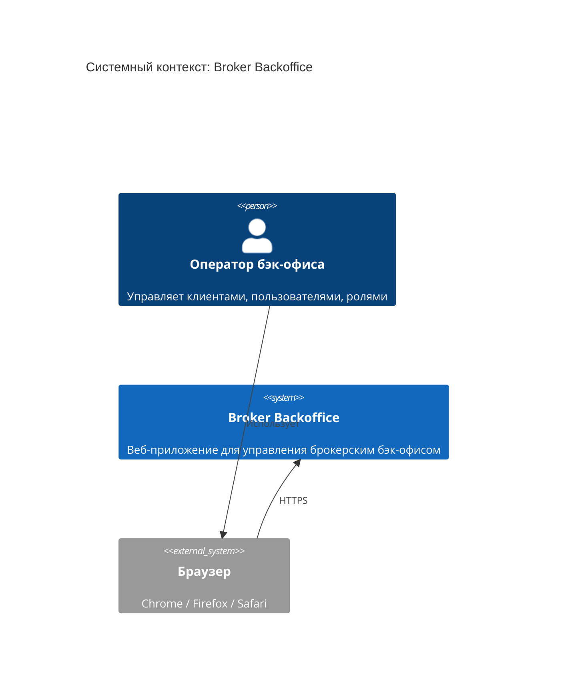
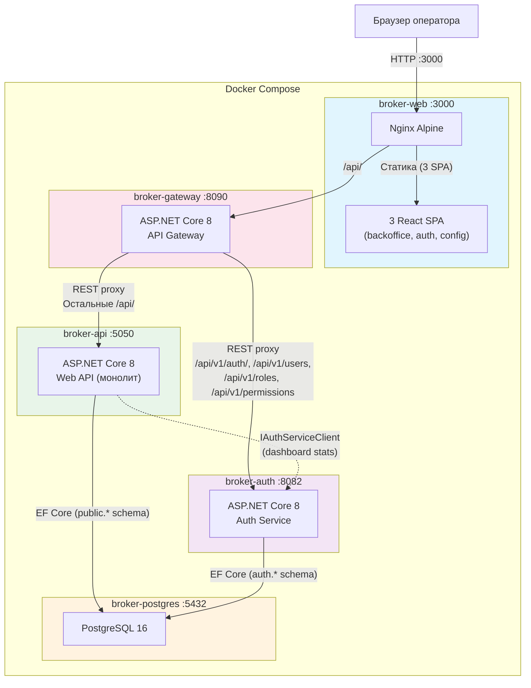
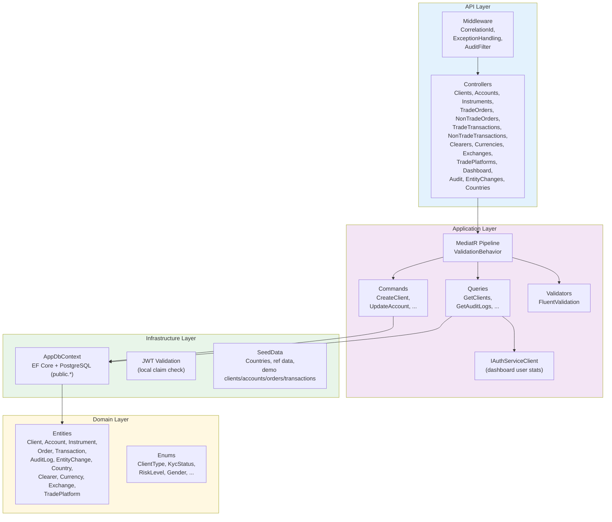
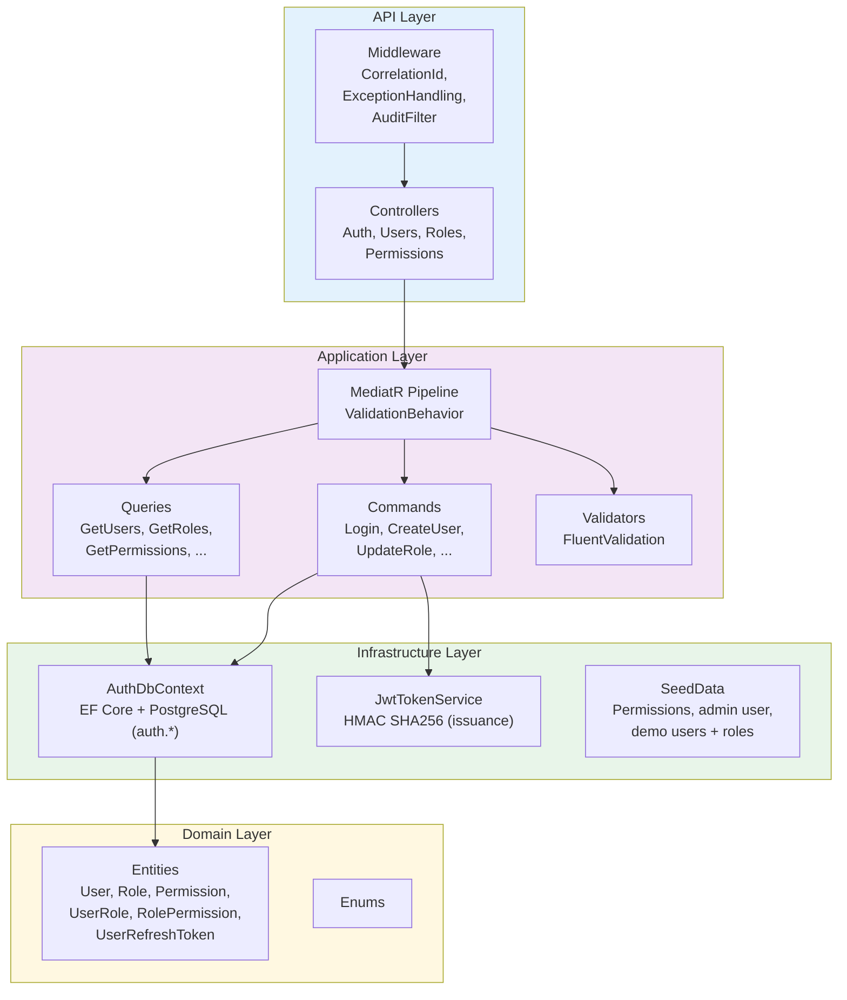

# 02. Системный контекст (C4-диаграммы)

## C4 Level 1 -- Контекст системы

```mermaid
C4Context
    title Системный контекст: Broker Backoffice

    Person(operator, "Оператор бэк-офиса", "Управляет клиентами, пользователями, ролями")
    System(backoffice, "Broker Backoffice", "Веб-приложение для управления брокерским бэк-офисом")
    System_Ext(browser, "Браузер", "Chrome / Firefox / Safari")

    Rel(operator, browser, "Использует")
    Rel(browser, backoffice, "HTTPS")
```

> **Примечание:** Внешних интеграций (платежные системы, KYC-провайдеры, биржи) на данный момент не обнаружено. Система работает автономно.

## C4 Level 2 -- Контейнеры

```mermaid
flowchart TB
    subgraph Docker["Docker Compose"]
        direction TB

        subgraph web["broker-web :3000"]
            nginx["Nginx Alpine"]
            spa["3 React SPA<br/>(backoffice, auth, config)"]
        end

        subgraph gw["broker-gateway :8090"]
            gateway["ASP.NET Core 8<br/>API Gateway"]
        end

        subgraph auth["broker-auth :8082"]
            authsvc["ASP.NET Core 8<br/>Auth Service"]
        end

        subgraph api["broker-api :5050"]
            dotnet["ASP.NET Core 8<br/>Web API (монолит)"]
        end

        subgraph db["broker-postgres :5432"]
            postgres["PostgreSQL 16"]
        end
    end

    browser["Браузер оператора"] -->|"HTTP :3000"| nginx
    nginx -->|"Статика (3 SPA)"| spa
    nginx -->|"/api/"| gateway
    gateway -->|"REST proxy<br/>/api/v1/auth/, /api/v1/users,<br/>/api/v1/roles, /api/v1/permissions"| authsvc
    gateway -->|"REST proxy<br/>Остальные /api/"| dotnet
    dotnet -->|"EF Core (public.* schema)"| postgres
    authsvc -->|"EF Core (auth.* schema)"| postgres
    dotnet -.->|"IAuthServiceClient<br/>(dashboard stats)"| authsvc

    style web fill:#e1f5fe
    style gw fill:#fce4ec
    style auth fill:#f3e5f5
    style api fill:#e8f5e9
    style db fill:#fff3e0
```

### Сетевая карта

| Контейнер | Внешний порт | Внутренний порт | Протокол |
|-----------|-------------|-----------------|----------|
| broker-web | 3000 | 8080 | HTTP (Nginx, non-root) |
| broker-gateway | 8090 | 8090 | HTTP (Kestrel) |
| broker-auth | 8082 | 8082 | HTTP (Kestrel) |
| broker-api | 5050 | 8080 | HTTP (Kestrel) |
| broker-postgres | 5432 | 5432 | TCP (PostgreSQL) |
| broker-n8n | 5678 | 5678 | HTTP (n8n) |
| broker-n8n-db | — | 5432 | TCP (PostgreSQL, internal) |

### Nginx маршрутизация

| Путь | Backend |
|------|---------|
| `/login`, `/users*`, `/roles*` | Auth SPA (`auth/index.html`) |
| `/config*` | Config SPA (`config/index.html`) |
| `/api/` | gateway:8090 |
| `~^/(backoffice\|auth\|config)/assets/` | Статические файлы (immutable cache 1y) |
| Всё остальное | Backoffice SPA (`backoffice/index.html`) |

### Health Checks

| Контейнер | Механизм | Интервал |
|-----------|----------|----------|
| postgres | `pg_isready -U postgres -d BrokerBackoffice` | 10s, 5 retries, start 10s |
| auth | `curl -f http://127.0.0.1:8082/health/live` | 10s, 5 retries, start 20s |
| api | `curl -f http://127.0.0.1:8080/health/live` | 10s, 5 retries, start 30s |
| gateway | `curl -f http://127.0.0.1:8090/health/live` | 10s, 5 retries, start 15s |
| web | `wget http://127.0.0.1:8080/` | 10s, 3 retries, start 5s |
| n8n-db | `pg_isready -U n8n -d n8n` | 10s, 5 retries, start 10s |
| n8n | `wget http://127.0.0.1:5678/healthz` | 10s, 5 retries, start 15s |

## C4 Level 3 -- Компоненты Backend (монолит)

```mermaid
flowchart TB
    subgraph API["API Layer"]
        controllers["Controllers<br/>Clients, Accounts, Instruments,<br/>TradeOrders, NonTradeOrders,<br/>TradeTransactions, NonTradeTransactions,<br/>Clearers, Currencies, Exchanges,<br/>TradePlatforms, Dashboard,<br/>Audit, EntityChanges, Countries"]
        middleware["Middleware<br/>CorrelationId,<br/>ExceptionHandling,<br/>AuditFilter"]
    end

    subgraph App["Application Layer"]
        commands["Commands<br/>CreateClient,<br/>UpdateAccount, ..."]
        queries["Queries<br/>GetClients,<br/>GetAuditLogs, ..."]
        validators["Validators<br/>FluentValidation"]
        pipeline["MediatR Pipeline<br/>ValidationBehavior"]
        authClient["IAuthServiceClient<br/>(dashboard user stats)"]
    end

    subgraph Domain["Domain Layer"]
        entities["Entities<br/>Client, Account, Instrument,<br/>Order, Transaction,<br/>AuditLog, EntityChange, Country,<br/>Clearer, Currency, Exchange,<br/>TradePlatform"]
        enums["Enums<br/>ClientType, KycStatus,<br/>RiskLevel, Gender, ..."]
    end

    subgraph Infra["Infrastructure Layer"]
        dbcontext["AppDbContext<br/>EF Core + PostgreSQL (public.*)"]
        jwtValidation["JWT Validation<br/>(local claim check)"]
        seed["SeedData<br/>Countries, ref data,<br/>demo clients/accounts/orders/transactions"]
    end

    controllers --> pipeline
    pipeline --> validators
    pipeline --> commands
    pipeline --> queries
    commands --> dbcontext
    queries --> dbcontext
    queries --> authClient
    middleware --> controllers
    dbcontext --> entities

    style API fill:#e3f2fd
    style App fill:#f3e5f5
    style Domain fill:#fff8e1
    style Infra fill:#e8f5e9
```

## C4 Level 3 -- Компоненты Auth Service

```mermaid
flowchart TB
    subgraph API["API Layer"]
        controllers["Controllers<br/>Auth, Users, Roles,<br/>Permissions"]
        middleware["Middleware<br/>CorrelationId,<br/>ExceptionHandling,<br/>AuditFilter"]
    end

    subgraph App["Application Layer"]
        commands["Commands<br/>Login, CreateUser,<br/>UpdateRole, ..."]
        queries["Queries<br/>GetUsers, GetRoles,<br/>GetPermissions, ..."]
        validators["Validators<br/>FluentValidation"]
        pipeline["MediatR Pipeline<br/>ValidationBehavior"]
    end

    subgraph Domain["Domain Layer"]
        entities["Entities<br/>User, Role, Permission,<br/>UserRole, RolePermission,<br/>UserRefreshToken"]
        enums["Enums"]
    end

    subgraph Infra["Infrastructure Layer"]
        dbcontext["AuthDbContext<br/>EF Core + PostgreSQL (auth.*)"]
        jwt["JwtTokenService<br/>HMAC SHA256 (issuance)"]
        seed["SeedData<br/>Permissions, admin user,<br/>demo users + roles"]
    end

    controllers --> pipeline
    pipeline --> validators
    pipeline --> commands
    pipeline --> queries
    commands --> dbcontext
    commands --> jwt
    queries --> dbcontext
    middleware --> controllers
    dbcontext --> entities

    style API fill:#e3f2fd
    style App fill:#f3e5f5
    style Domain fill:#fff8e1
    style Infra fill:#e8f5e9
```

## C4 Level 3 -- Компоненты Frontend (3 SPA)

```mermaid
flowchart TB
    subgraph Entry["Точки входа (3 main.tsx)"]
        mainBO["backoffice/main.tsx"]
        mainAuth["auth/main.tsx"]
        mainCfg["config/main.tsx"]
    end

    subgraph BackofficePages["Backoffice SPA — Страницы"]
        dashboard["DashboardPage"]
        clients["ClientsPage"]
        accounts["AccountsPage"]
        instruments["InstrumentsPage"]
        tradeOrders["TradeOrdersPage"]
        nonTradeOrders["NonTradeOrdersPage"]
        tradeTx["TradeTransactionsPage"]
        nonTradeTx["NonTradeTransactionsPage"]
        audit["AuditPage"]
        settings["SettingsPage"]
    end

    subgraph AuthPages["Auth SPA — Страницы"]
        login["LoginPage"]
        users["UsersPage"]
        roles["RolesPage"]
        profile["ProfileTab"]
    end

    subgraph ConfigPages["Config SPA — Страницы"]
        menuCfg["MenuConfigPage"]
        entityCfg["EntityConfigPage"]
        upstreamCfg["UpstreamConfigPage"]
    end

    subgraph Shared["@broker/ui-kit (shared)"]
        layout["MainLayout<br/>Динамический Sidebar"]
        navProvider["NavigationProvider<br/>Кросс-SPA навигация"]
        pageContainer["PageContainer"]
        grid["FilteredDataGrid<br/>+ InlineFilters"]
        dialogs["Диалоги<br/>Create/Edit/Permissions"]
    end

    subgraph Data["Данные"]
        apiClient["Axios Client<br/>+ Token Refresh"]
        hooks["React Query Hooks<br/>useClients, useUsers, ..."]
        authCtx["AuthContext<br/>useAuth, usePermission"]
        configApi["Config API<br/>useMenu, useEntityConfig"]
    end

    mainBO --> layout
    mainAuth --> layout
    mainCfg --> layout

    layout --> navProvider
    layout --> dashboard & clients & accounts & instruments & tradeOrders & nonTradeOrders & tradeTx & nonTradeTx & audit & settings
    layout --> login & users & roles & profile
    layout --> menuCfg & entityCfg & upstreamCfg

    clients & accounts & instruments & tradeOrders & nonTradeOrders & tradeTx & nonTradeTx & users & roles & audit --> grid
    clients & accounts & instruments & users & roles --> dialogs
    grid --> hooks
    hooks --> apiClient
    layout --> authCtx
    layout --> configApi

    style Entry fill:#e3f2fd
    style BackofficePages fill:#f3e5f5
    style AuthPages fill:#f3e5f5
    style ConfigPages fill:#f3e5f5
    style Shared fill:#fff8e1
    style Data fill:#e8f5e9
```
