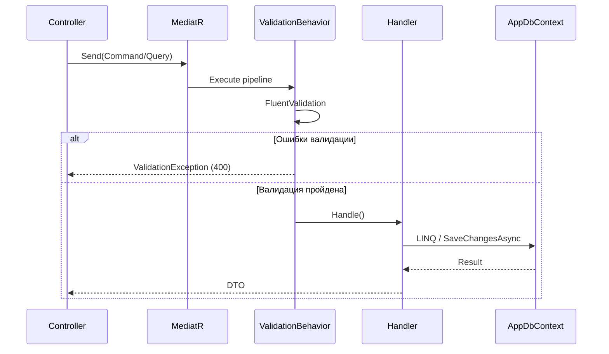

# 03. Backend

## Точка входа и пайплайн

**Program.cs** настраивает middleware в следующем порядке:

```
Request
  -> CorrelationIdMiddleware (X-Correlation-Id)
  -> Serilog Request Logging
  -> ExceptionHandlingMiddleware
  -> CORS
  -> Authentication (JWT Bearer)
  -> Authorization (Permission-based)
  -> Controllers
  -> AuditActionFilter (POST/PUT/PATCH/DELETE)
Response
```

При старте приложение:
1. Применяет EF Core миграции автоматически
2. Засеивает данные (permissions, countries, admin user, опционально demo data)

## API Endpoints

**Base URL:** `/api/v1`

### Аутентификация (AuthController)

| Метод | Маршрут | Авторизация | Описание |
|-------|---------|-------------|----------|
| POST | `/auth/login` | Нет | Логин (username + password) -> tokens |
| POST | `/auth/refresh` | Нет | Обновление access token по refresh token |
| GET | `/auth/me` | Bearer | Текущий профиль (user, roles, permissions, scopes) |

### Пользователи (UsersController)

| Метод | Маршрут | Permission | Аудит |
|-------|---------|-----------|-------|
| GET | `/users` | users.read | - |
| GET | `/users/{id}` | users.read | - |
| POST | `/users` | users.create | Да |
| PUT | `/users/{id}` | users.update | Да |
| DELETE | `/users/{id}` | users.delete | Да |

**Фильтры GET /users:** Page, PageSize, Sort, Q (глобальный поиск), IsActive, Username, Email, FullName, Role.

### Роли (RolesController)

| Метод | Маршрут | Permission | Аудит |
|-------|---------|-----------|-------|
| GET | `/roles` | roles.read | - |
| GET | `/roles/{id}` | roles.read | - |
| POST | `/roles` | roles.create | Да |
| PUT | `/roles/{id}` | roles.update | Да |
| DELETE | `/roles/{id}` | roles.delete | Да |
| PUT | `/roles/{id}/permissions` | roles.update | Да |

**Защита:** системные роли (`IsSystem = true`) нельзя изменить или удалить.

### Права (PermissionsController)

| Метод | Маршрут | Permission |
|-------|---------|-----------|
| GET | `/permissions` | permissions.read |

### Клиенты (ClientsController)

| Метод | Маршрут | Permission | Аудит |
|-------|---------|-----------|-------|
| GET | `/clients` | clients.read | - |
| GET | `/clients/{id}` | clients.read | - |
| POST | `/clients` | clients.create | Да |
| PUT | `/clients/{id}` | clients.update | Да |
| DELETE | `/clients/{id}` | clients.delete | Да |

**Расширенные фильтры GET /clients:** Name, Email, Phone, ExternalId, Status[], ClientType[], KycStatus[], RiskLevel[], ResidenceCountryIds[], CitizenshipCountryIds[], CreatedFrom, CreatedTo, PepStatus.

### Страны (CountriesController)

| Метод | Маршрут | Permission |
|-------|---------|-----------|
| GET | `/countries` | clients.read |

### Аудит (AuditController)

| Метод | Маршрут | Permission |
|-------|---------|-----------|
| GET | `/audit` | audit.read |
| GET | `/audit/{id}` | audit.read |

**Фильтры GET /audit:** From, To, UserId, Action, EntityType, IsSuccess, UserName, Method, Path, StatusCode.

## CQRS Pattern

Все операции проходят через MediatR:



## Обработка ошибок

**ExceptionHandlingMiddleware** преобразует исключения в ProblemDetails:

| Исключение | HTTP код | Заголовок |
|------------|----------|-----------|
| `ValidationException` | 400 | Validation Error |
| `UnauthorizedAccessException` | 401 | Unauthorized |
| `KeyNotFoundException` | 404 | Not Found |
| `InvalidOperationException` | 409 | Conflict |
| `DbUpdateConcurrencyException` | 409 | Concurrency Conflict |
| Любое другое | 500 | Server Error |

## Оптимистичная конкурентность

Все мутирующие операции над User, Role, Client используют `RowVersion` (SQL Server `rowversion`):

1. Клиент получает сущность с `RowVersion`
2. При обновлении передает `RowVersion` обратно
3. EF Core проверяет совпадение версии при `SaveChangesAsync`
4. Несовпадение -> `DbUpdateConcurrencyException` -> 409 Conflict

## Аудит

**AuditActionFilter** перехватывает POST/PUT/PATCH/DELETE:

1. До выполнения action: сохраняет `BeforeJson` из `AuditContext`
2. После выполнения: записывает `AuditLog` с UserId, UserName, Action, EntityType, EntityId, Before/AfterJson, CorrelationId, IP, UserAgent, Path, Method, StatusCode, IsSuccess
3. JSON обрезается до 16384 байт
4. Ошибки записи аудита логируются, но не прерывают запрос

## Конфигурация

```json
{
  "ConnectionStrings": {
    "DefaultConnection": "Server=...; Database=BrokerBackoffice; ..."
  },
  "Jwt": {
    "Secret": "min 32 chars",
    "Issuer": "BrokerBackoffice",
    "Audience": "BrokerBackoffice",
    "AccessTokenExpirationMinutes": 30,
    "RefreshTokenExpirationDays": 7
  },
  "Cors": {
    "Origins": ["http://localhost:5173", "http://localhost:3000"]
  }
}
```

Переменные окружения (docker-compose) переопределяют секции конфигурации (`ConnectionStrings__DefaultConnection`, `Jwt__Secret`).
