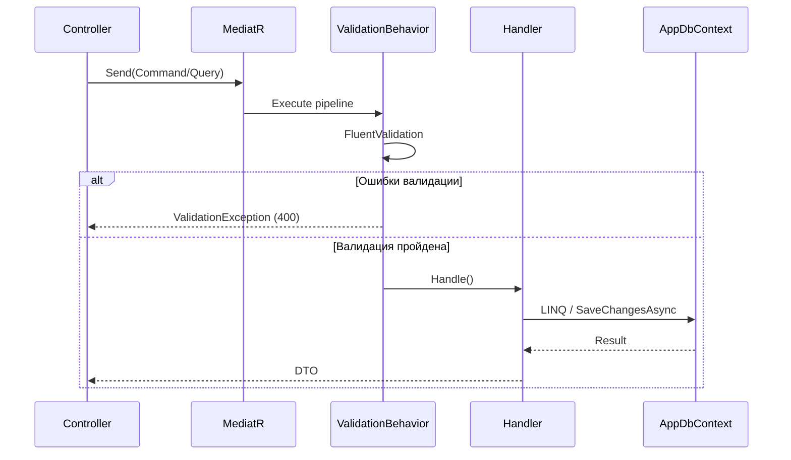

# 03. Backend

## Точка входа и пайплайн

**Program.cs** настраивает middleware в следующем порядке:

```
Request
  -> CorrelationIdMiddleware (X-Correlation-Id)
  -> Serilog Request Logging
  -> ExceptionHandlingMiddleware
  -> CORS
  -> Authentication (JWT Bearer)
  -> Authorization (Permission-based)
  -> Controllers
  -> AuditActionFilter (POST/PUT/PATCH/DELETE)
Response
```

При старте приложение:
1. Применяет EF Core миграции автоматически
2. Засеивает данные (permissions, countries, admin user, опционально demo data)

## API Endpoints

**Base URL:** `/api/v1`

### Аутентификация и профиль (AuthController)

| Метод | Маршрут | Авторизация | Описание |
|-------|---------|-------------|----------|
| POST | `/auth/login` | Нет | Логин (username + password) -> tokens |
| POST | `/auth/refresh` | Нет | Обновление access token по refresh token |
| GET | `/auth/me` | Bearer | Текущий профиль (user, roles, permissions, scopes) |
| PUT | `/auth/profile` | Bearer | Обновление профиля (fullName, email) -> UserProfileResponse |
| POST | `/auth/change-password` | Bearer | Смена пароля (currentPassword, newPassword) -> 204 |

### Пользователи (UsersController)

| Метод | Маршрут | Permission | Аудит |
|-------|---------|-----------|-------|
| GET | `/users` | users.read | - |
| GET | `/users/{id}` | users.read | - |
| POST | `/users` | users.create | Да |
| PUT | `/users/{id}` | users.update | Да |
| DELETE | `/users/{id}` | users.delete | Да |

**Фильтры GET /users:** Page, PageSize, Sort, Q (глобальный поиск), IsActive, Username, Email, FullName, Role.

### Роли (RolesController)

| Метод | Маршрут | Permission | Аудит |
|-------|---------|-----------|-------|
| GET | `/roles` | roles.read | - |
| GET | `/roles/{id}` | roles.read | - |
| POST | `/roles` | roles.create | Да |
| PUT | `/roles/{id}` | roles.update | Да |
| DELETE | `/roles/{id}` | roles.delete | Да |
| PUT | `/roles/{id}/permissions` | roles.update | Да |

**Защита:** системные роли (`IsSystem = true`) нельзя изменить или удалить.

### Права (PermissionsController)

| Метод | Маршрут | Permission |
|-------|---------|-----------|
| GET | `/permissions` | permissions.read |

### Клиенты (ClientsController)

| Метод | Маршрут | Permission | Аудит |
|-------|---------|-----------|-------|
| GET | `/clients` | clients.read | - |
| GET | `/clients/{id}` | clients.read | - |
| POST | `/clients` | clients.create | Да |
| PUT | `/clients/{id}` | clients.update | Да |
| DELETE | `/clients/{id}` | clients.delete | Да |
| GET | `/clients/{id}/accounts` | clients.read | - |
| PUT | `/clients/{id}/accounts` | clients.update | Да |

**Расширенные фильтры GET /clients:** Name, Email, Phone, ExternalId, Status[], ClientType[], KycStatus[], RiskLevel[], ResidenceCountryIds[], CitizenshipCountryIds[], CreatedFrom, CreatedTo, PepStatus.

**Фильтр Name** поддерживает поиск по полному имени (FirstName + LastName), а также по CompanyName.

### Счета (AccountsController)

| Метод | Маршрут | Permission | Аудит |
|-------|---------|-----------|-------|
| GET | `/accounts` | accounts.read | - |
| GET | `/accounts/{id}` | accounts.read | - |
| POST | `/accounts` | accounts.create | Да |
| PUT | `/accounts/{id}` | accounts.update | Да |
| DELETE | `/accounts/{id}` | accounts.delete | Да |
| PUT | `/accounts/{id}/holders` | accounts.update | Да |

**Фильтры GET /accounts:** Number, Status[], AccountType[], MarginType[], Tariff[].

### Справочники (Clearers, TradePlatforms, Exchanges, Currencies)

GET без `/all` возвращает только active-записи (для dropdown'ов). GET `/all` возвращает все записи, включая inactive (для управления справочниками). Delete защищён от удаления записей с FK-зависимостями (409 Conflict).

### Клиринговые компании (ClearersController)

| Метод | Маршрут | Permission |
|-------|---------|-----------|
| GET | `/clearers` | accounts.read |
| GET | `/clearers/all` | settings.manage |
| POST | `/clearers` | settings.manage |
| PUT | `/clearers/{id}` | settings.manage |
| DELETE | `/clearers/{id}` | settings.manage |

### Торговые платформы (TradePlatformsController)

| Метод | Маршрут | Permission |
|-------|---------|-----------|
| GET | `/trade-platforms` | accounts.read |
| GET | `/trade-platforms/all` | settings.manage |
| POST | `/trade-platforms` | settings.manage |
| PUT | `/trade-platforms/{id}` | settings.manage |
| DELETE | `/trade-platforms/{id}` | settings.manage |

### Страны (CountriesController)

| Метод | Маршрут | Permission |
|-------|---------|-----------|
| GET | `/countries` | clients.read |

### Инструменты (InstrumentsController)

| Метод | Маршрут | Permission | Аудит |
|-------|---------|-----------|-------|
| GET | `/instruments` | instruments.read | - |
| GET | `/instruments/{id}` | instruments.read | - |
| POST | `/instruments` | instruments.create | Да |
| PUT | `/instruments/{id}` | instruments.update | Да |
| DELETE | `/instruments/{id}` | instruments.delete | Да |

**Фильтры GET /instruments:** Symbol, Name, Type[], AssetClass[], Status[], Sector[], ExchangeName, CurrencyCode, IsMarginEligible.

### Биржи (ExchangesController)

| Метод | Маршрут | Permission |
|-------|---------|-----------|
| GET | `/exchanges` | instruments.read |
| GET | `/exchanges/all` | settings.manage |
| POST | `/exchanges` | settings.manage |
| PUT | `/exchanges/{id}` | settings.manage |
| DELETE | `/exchanges/{id}` | settings.manage |

### Валюты (CurrenciesController)

| Метод | Маршрут | Permission |
|-------|---------|-----------|
| GET | `/currencies` | instruments.read |
| GET | `/currencies/all` | settings.manage |
| POST | `/currencies` | settings.manage |
| PUT | `/currencies/{id}` | settings.manage |
| DELETE | `/currencies/{id}` | settings.manage |

### Торговые поручения (TradeOrdersController)

| Метод | Маршрут | Permission | Аудит |
|-------|---------|-----------|-------|
| GET | `/trade-orders` | orders.read | - |
| GET | `/trade-orders/{id}` | orders.read | - |
| POST | `/trade-orders` | orders.create | Да |
| PUT | `/trade-orders/{id}` | orders.update | Да |
| DELETE | `/trade-orders/{id}` | orders.delete | Да |

**Фильтры GET /trade-orders:** AccountId[], InstrumentId[], Status[], Side[], OrderType[], TimeInForce[], OrderDateFrom, OrderDateTo, QuantityFrom, QuantityTo, PriceFrom, PriceTo.

**Бизнес-валидация (Create/Update):** Price обязателен для Limit/StopLimit, StopPrice обязателен для Stop/StopLimit, ExpirationDate обязателен для GTD. FK-валидация: Account и Instrument проверяются через `AnyAsync` перед сохранением.

### Неторговые поручения (NonTradeOrdersController)

| Метод | Маршрут | Permission | Аудит |
|-------|---------|-----------|-------|
| GET | `/non-trade-orders` | orders.read | - |
| GET | `/non-trade-orders/{id}` | orders.read | - |
| POST | `/non-trade-orders` | orders.create | Да |
| PUT | `/non-trade-orders/{id}` | orders.update | Да |
| DELETE | `/non-trade-orders/{id}` | orders.delete | Да |

**Фильтры GET /non-trade-orders:** AccountId[], InstrumentId[], Status[], NonTradeType[], OrderDateFrom, OrderDateTo, AmountFrom, AmountTo.

**FK-валидация (Create/Update):** Account, Currency и Instrument (если указан) проверяются через `AnyAsync` перед сохранением.

### Дашборд (DashboardController)

| Метод | Маршрут | Авторизация | Описание |
|-------|---------|-------------|----------|
| GET | `/dashboard/stats` | Bearer | Агрегированная статистика (клиенты, счета, инструменты, пользователи) |

### Аудит (AuditController)

| Метод | Маршрут | Permission |
|-------|---------|-----------|
| GET | `/audit` | audit.read |
| GET | `/audit/{id}` | audit.read |

**Фильтры GET /audit:** From, To, UserId, Action, EntityType, IsSuccess, UserName, Method, Path, StatusCode.

### История изменений (EntityChangesController)

| Метод | Маршрут | Permission | Описание |
|-------|---------|-----------|----------|
| GET | `/entity-changes` | audit.read | История конкретной сущности |
| GET | `/entity-changes/all` | audit.read | Глобальная лента всех изменений |

**GET /entity-changes:** EntityType, EntityId, Page, PageSize — история конкретной сущности.

**GET /entity-changes/all:** Page, PageSize, Sort, From, To, UserName[] (массив), EntityType, ChangeType (Created/Modified/Deleted), Q — глобальная лента всех изменений (используется на странице Audit Log). Поддерживаемые поля сортировки: Timestamp (по умолчанию), EntityDisplayName, UserName, EntityType.

## CQRS Pattern

Все операции проходят через MediatR:



## Обработка ошибок

**ExceptionHandlingMiddleware** преобразует исключения в ProblemDetails:

| Исключение | HTTP код | Заголовок |
|------------|----------|-----------|
| `ValidationException` | 400 | Validation Error |
| `UnauthorizedAccessException` | 401 | Unauthorized |
| `KeyNotFoundException` | 404 | Not Found |
| `InvalidOperationException` | 409 | Conflict |
| `DbUpdateConcurrencyException` | 409 | Concurrency Conflict |
| Любое другое | 500 | Server Error |

## Оптимистичная конкурентность

Все мутирующие операции над User, Role, Client, Account, Order используют `RowVersion` (SQL Server `rowversion`):

1. Клиент получает сущность с `RowVersion`
2. При обновлении передает `RowVersion` обратно
3. EF Core проверяет совпадение версии при `SaveChangesAsync`
4. Несовпадение -> `DbUpdateConcurrencyException` -> 409 Conflict

## Аудит

### HTTP-уровневый аудит (AuditLog)

**AuditActionFilter** перехватывает POST/PUT/PATCH/DELETE:

1. До выполнения action: сохраняет `BeforeJson` из `AuditContext`
2. После выполнения: записывает `AuditLog` с UserId, UserName, Action, EntityType, EntityId, Before/AfterJson, CorrelationId, IP, UserAgent, Path, Method, StatusCode, IsSuccess
3. JSON обрезается до 16384 байт
4. Ошибки записи аудита логируются, но не прерывают запрос

### Entity Change Tracking

Автоматическое отслеживание изменений на уровне полей через override `SaveChangesAsync` в `AppDbContext`. Для каждой сущности сохраняется полная история: кто, когда, какое поле, старое → новое значение.

**Архитектура:**

```
SaveChangesAsync()
  ├── CaptureChanges()         — итерация ChangeTracker.Entries()
  │     ├── CaptureCreated()   — все non-null свойства
  │     ├── CaptureModified()  — только реально изменённые свойства
  │     └── CaptureDeleted()   — все non-null оригинальные значения
  ├── DeduplicateReplacedEntities()  — устранение phantom-изменений (clear+re-add)
  ├── base.SaveChangesAsync()  — сохранение бизнес-данных
  └── base.SaveChangesAsync()  — сохранение EntityChange записей (_suppressChangeTracking)
```

**Отслеживаемые сущности:**

| Сущность | Тип | Родитель | Описание |
|----------|-----|----------|----------|
| Client | root | — | Клиенты |
| ClientAddress | child | Client | Адреса клиентов |
| InvestmentProfile | child | Client | Инвестиционный профиль |
| Account | root | — | Счета |
| AccountHolder | child | Account + Client | Связь счёт-клиент (dual parent) |
| Instrument | root | — | Инструменты |
| Order | root | — | Поручения (торговые и неторговые) |
| User | root | — | Пользователи (PasswordHash исключён) |
| UserRole | child | User | Роли пользователя |
| Role | root | — | Роли |
| RolePermission | child | Role | Права роли |

**Ключевые механизмы:**

- **Request-scoped OperationId** — все `SaveChangesAsync` вызовы в рамках одного HTTP-запроса делят один `OperationId` (через `IChangeTrackingContext`)
- **Diff-подход для join-таблиц** — `SetRolePermissions` и `UpdateUser` используют diff (добавление/удаление только изменённых записей), а не "clear all + re-add", что обеспечивает точную историю: одна изменённая галочка = одна запись в истории
- **Deduplication** — "clear all + re-add" паттерн (адреса, холдеры) автоматически определяется и преобразуется в "Modified" записи только для реально изменённых полей
- **FK-разрешение** — значения FK-полей (ResidenceCountryId, ClearerId, ExchangeId, PermissionId, RoleId и т.д.) автоматически резолвятся в человекочитаемые имена (название страны, клиринга, код permission, имя роли и т.д.)
- **Display Names** — для каждой записи вычисляется контекстное имя: "Legal, 612 Oak Ave, Berlin" для адреса, "Owner, Matthew Clark" для холдера
- **Dual parent (AccountHolder)** — изменения записываются в историю обоих родителей (Account и Client) с контекстно-зависимыми display names
- **FullName** — в поле UserName записывается ФИО пользователя (из JWT-claim `full_name`), а не логин

## Конфигурация

```json
{
  "ConnectionStrings": {
    "DefaultConnection": "Server=...; Database=BrokerBackoffice; ..."
  },
  "Jwt": {
    "Secret": "min 32 chars",
    "Issuer": "BrokerBackoffice",
    "Audience": "BrokerBackoffice",
    "AccessTokenExpirationMinutes": 30,
    "RefreshTokenExpirationDays": 7
  },
  "Cors": {
    "Origins": ["http://localhost:5173", "http://localhost:3000"]
  }
}
```

Переменные окружения (docker-compose) переопределяют секции конфигурации (`ConnectionStrings__DefaultConnection`, `Jwt__Secret`).
