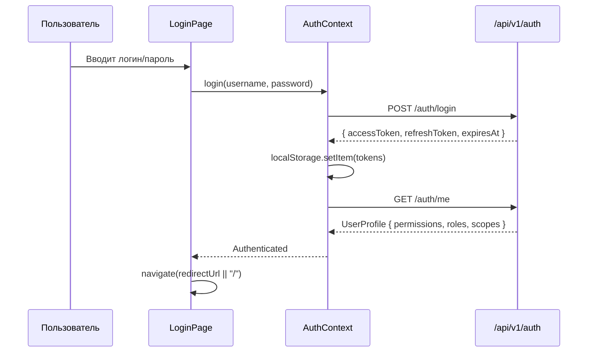

# 04. Frontend

## Архитектура

SPA на React 18 + TypeScript. Вся логика работы с данными вынесена в React Query хуки, UI построен на Material UI 6.

### Иерархия провайдеров (main.tsx)

```
QueryClientProvider (retry: 1, refetchOnWindowFocus: false)
  ThemeProvider (MUI theme)
    CssBaseline
      LocalizationProvider (DayJS)
        AuthProvider (контекст аутентификации)
          RouterProvider (React Router v6)
```

## Маршрутизация

```
/login                    -> LoginPage (публичный)
/                         -> MainLayout (защищенный через RequireAuth)
  / (index)              -> DashboardPage
  /clients               -> ClientsPage
  /clients/:id           -> ClientDetailsPage
  /accounts              -> AccountsPage
  /accounts/:id          -> AccountDetailsPage
  /instruments           -> InstrumentsPage
  /instruments/:id       -> InstrumentDetailsPage
  /users                 -> UsersPage
  /roles                 -> RolesPage
  /roles/:id             -> RoleDetailsPage
  /audit                 -> AuditPage
  /settings              -> SettingsPage
```

Все маршруты кроме `/login` обёрнуты в `<RequireAuth>`, который проверяет `isAuthenticated` из AuthContext и редиректит на `/login`.

## Аутентификация

### Поток логина



### Автоматическое обновление токена

Axios interceptor при получении 401:
1. Ставит запрос в очередь
2. Отправляет POST `/auth/refresh` (один раз, без thundering herd)
3. При успехе: обновляет токены в localStorage, повторяет все запросы из очереди
4. При неудаче: очищает localStorage, редиректит на `/login`

### Хранение

- `localStorage.accessToken` -- JWT access token
- `localStorage.refreshToken` -- refresh token
- Нет httpOnly cookies (SPA-подход)

## API-клиент

**Axios instance** (`src/api/client.ts`):

```
baseURL: import.meta.env.VITE_API_URL ?? "/api/v1"
```

Request interceptor:
- Добавляет `Authorization: Bearer {token}`
- Добавляет `X-Correlation-Id` (случайный UUID)

## Хуки данных (React Query)

Все хуки в `src/api/hooks.ts`:

| Хук | Endpoint | Кеш |
|-----|----------|-----|
| `useMe(enabled)` | GET /auth/me | default |
| `useUsers(params)` | GET /users | default |
| `useUser(id)` | GET /users/{id} | default |
| `useRoles(params)` | GET /roles | default |
| `useRole(id)` | GET /roles/{id} | default |
| `usePermissions()` | GET /permissions | staleTime: 10 мин |
| `useClients(params)` | GET /clients | default |
| `useClient(id)` | GET /clients/{id} | default |
| `useClientAccounts(clientId)` | GET /clients/{id}/accounts | default |
| `useAccounts(params)` | GET /accounts | default |
| `useAccount(id)` | GET /accounts/{id} | default |
| `useInstruments(params)` | GET /instruments | default |
| `useInstrument(id)` | GET /instruments/{id} | default |
| `useExchanges()` | GET /exchanges | staleTime: 10 мин |
| `useCurrencies()` | GET /currencies | staleTime: 10 мин |
| `useAuditLogs(params)` | GET /audit | default |
| `useAuditLog(id)` | GET /audit/{id} | default |
| `useEntityChanges(params, enabled)` | GET /entity-changes | default |
| `useAllEntityChanges(params)` | GET /entity-changes/all | default |
| `useCountries()` | GET /countries | staleTime: 10 мин |
| `useClearers()` | GET /clearers | staleTime: 10 мин |
| `useTradePlatforms()` | GET /trade-platforms | staleTime: 10 мин |

Мутации (`useCreateUser`, `useUpdateUser`, `useDeleteUser`, `useCreateClient`, `useUpdateClient`, `useDeleteClient`, `useCreateAccount`, `useUpdateAccount`, `useDeleteAccount`, `useSetAccountHolders`, `useSetClientAccounts`, `useCreateInstrument`, `useUpdateInstrument`, `useDeleteInstrument` и т.д.) инвалидируют соответствующий queryKey при успехе.

Все хуки используют `cleanParams()` для удаления undefined/null/empty значений перед отправкой.

## Страницы

### Общие паттерны

- **Server-side pagination/sorting/filtering** -- все таблицы
- **URL state** -- фильтры и пагинация сохраняются в URLSearchParams
- **Permission-based UI** -- кнопки/действия скрываются через `useHasPermission()`
- **Debounced search** -- глобальный поиск 300ms задержка
- **Row click** -- клик по строке DataGrid открывает карточку просмотра (Clients, Accounts, Instruments, Roles → navigate на detail page; Users → открытие EditDialog). Кнопки действий используют `e.stopPropagation()` чтобы не триггерить row click

### Компоненты таблиц

`FilteredDataGrid` -- обёртка над MUI X DataGrid:
- Встроенная строка фильтров (`FilterRowProvider` + контекст)
- Синхронизация скролла фильтров с таблицей
- Inline-фильтры: `InlineTextFilter`, `CompactMultiSelect`, `CompactCountrySelect`, `DateRangePopover`, `InlineBooleanFilter`

### Диалоги

Каждая CRUD-страница имеет диалоги Create/Edit:
- `UserDialogs` -- создание/редактирование пользователя
- `RoleDialogs` -- создание/редактирование роли (EditRoleDialog включает секцию Permissions с чекбоксами по группам)
- `ClientDialogs` -- сложные формы с условными полями (Individual vs Corporate), адресами, инвестиционным профилем, привязкой счетов
- `AccountDialogs` -- создание/редактирование счёта с Autocomplete для Clearer/TradePlatform, управление холдерами
- `InstrumentDialogs` -- создание/редактирование инструмента с Autocomplete для Exchange/Currency/Country

Страницы деталей:
- `ClientDetailsPage` -- просмотр клиента со связанными счетами (с навигацией на счёт)
- `AccountDetailsPage` -- просмотр счёта со связанными холдерами (с навигацией на клиента)
- `InstrumentDetailsPage` -- просмотр инструмента со всеми параметрами
- `RoleDetailsPage` -- просмотр роли: общие данные + permissions с чекбоксами (read-only, сгруппированные по группам)

### EntityHistoryDialog

Переиспользуемый компонент `EntityHistoryDialog` для просмотра поле-уровневой истории изменений сущности. Интегрирован в:
- `ClientDetailsPage`, `AccountDetailsPage`, `InstrumentDetailsPage`, `RoleDetailsPage` — кнопка "History"
- `UsersPage` — иконка History в строке DataGrid

### AuditPage (глобальная лента изменений)

Страница Audit Log отображает глобальную ленту всех изменений сущностей в виде DataGrid с серверной пагинацией/сортировкой/фильтрацией (endpoint `GET /entity-changes/all`).

**Колонки:** Timestamp, User, Entity Type, Name, Change Type.

**Фильтры:** DateRangePopover (from/to), CompactMultiSelect для User/EntityType/ChangeType, InlineTextFilter для Name, глобальный поиск.

**Row click** открывает `AuditDetailDialog` — диалог с детальным просмотром полей изменения (аналог EntityHistoryDialog для конкретной операции).

**Особенности:**
- Отображает операции в виде Accordion: дата/время (до секунд), ФИО пользователя, тип изменения
- Группировка: корневая сущность + связанные (адреса, холдеры, профиль и т.д.)
- Контекстные display names: "Legal, 612 Oak Ave, Berlin" для адреса, "Owner, Matthew Clark" для холдера
- FK-значения отображаются как человекочитаемые имена (название страны, а не GUID)
- Цветовая маркировка: Created (зелёный), Modified (жёлтый), Deleted (красный)
- Маппинг имён полей → читаемые лейблы (ResidenceCountryId → "Residence Country")
- Пагинация
- Доступен только при наличии permission `audit.read`

## Тема

Два варианта MUI theme:
- **Основная тема** -- `#1565c0` primary, `#7b1fa2` secondary, Inter/Roboto шрифт
- **List theme** (для страниц со списками) -- компактные размеры: маленькие кнопки, чипы, строки таблицы 44px

## Управление состоянием

| Тип состояния | Инструмент |
|---------------|------------|
| Серверные данные | React Query |
| Аутентификация | React Context (AuthContext) |
| URL / фильтры | URLSearchParams |
| Локальный UI | useState / useReducer |

Redux, Zustand и другие стейт-менеджеры **не используются**.

## Отсутствующие паттерны

- **Error Boundaries** -- не реализованы
- **Suspense / lazy loading** -- не используется (весь бандл загружается сразу, ~1.2 MB gzip ~370 KB)
- **i18n** -- не реализовано (UI на английском)
