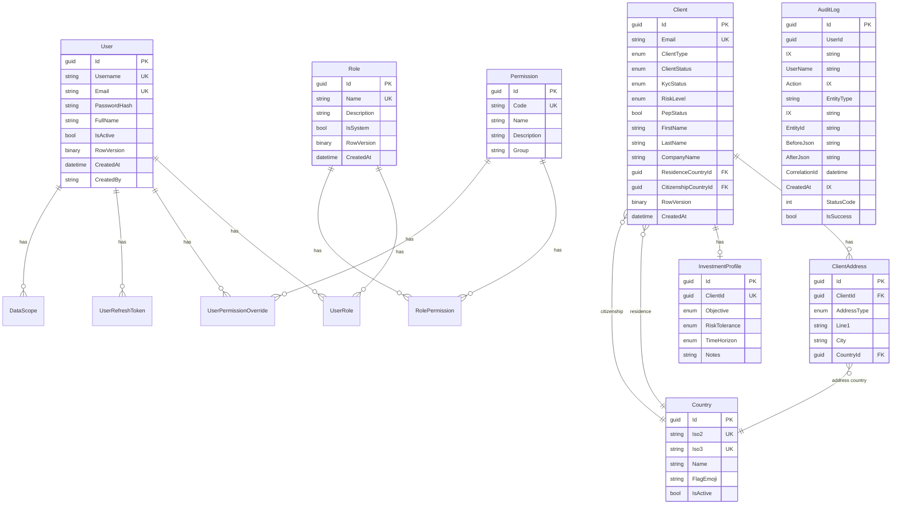

# 05. Данные

## СУБД

**Microsoft SQL Server 2022** (Docker-образ `mcr.microsoft.com/mssql/server:2022-latest`).

Доступ через EF Core 8. ORM используется для всех операций (нет Dapper / raw SQL).

## Схема базы данных

## Ключевые сущности

### Identity & Access

| Таблица | Назначение | Уникальные индексы |
|---------|------------|-------------------|
| Users | Пользователи системы | Username, Email |
| Roles | Роли (в т.ч. системные) | Name |
| Permissions | Гранулярные права (14 шт.) | Code |
| UserRoles | Связь M:N User <-> Role | (UserId, RoleId) |
| RolePermissions | Связь M:N Role <-> Permission | (RoleId, PermissionId) |
| UserPermissionOverrides | Персональные переопределения прав | (UserId, PermissionId) |
| DataScopes | Области видимости данных (row-level) | (UserId, ScopeType, ScopeValue) |
| UserRefreshTokens | Refresh-токены с ротацией | TokenHash |

### Клиенты

| Таблица | Назначение | Особенности |
|---------|------------|-------------|
| Clients | Клиенты (Individual / Corporate) | Условные поля по ClientType |
| ClientAddresses | Адреса клиентов (Legal/Mailing/Working) | Cascade delete |
| InvestmentProfiles | Инвестиционный профиль (1:1 с Client) | Cascade delete |
| Countries | Справочник стран (ISO 3166) | Seed data |

### Аудит

| Таблица | Назначение | Особенности |
|---------|------------|-------------|
| AuditLogs | Лог всех мутаций | Индексы: CreatedAt, UserId, Action, EntityType |

## Перечисления (Enums)

Хранятся как `int` в БД:

| Enum | Значения |
|------|----------|
| ClientType | Individual (0), Corporate (1) |
| ClientStatus | Active (0), Blocked (1), PendingKyc (2) |
| KycStatus | NotStarted (0), InProgress (1), Approved (2), Rejected (3) |
| RiskLevel | Low (0), Medium (1), High (2) |
| Gender | Male (0), Female (1), Other (2), Unspecified (3) |
| AddressType | Legal (0), Mailing (1), Working (2) |
| InvestmentObjective | Preservation (0), Income (1), Growth (2), Speculation (3), Hedging (4), Other (5) |

## Миграции

EF Core Code-First миграции:

| # | Имя | Описание |
|---|-----|----------|
| 1 | 20260217195408_IdentityAccess_Initial | Users, Roles, Permissions, RefreshTokens |
| 2 | 20260218151925_AddClients | Clients, ClientAddresses, InvestmentProfiles |
| 3 | 20260219100000_ExtendClientsAndCountries | Countries, связи с клиентами |
| 4 | 20260219120000_AddCountryFlagEmoji | Колонка FlagEmoji |

Миграции применяются **автоматически** при старте приложения (`context.Database.MigrateAsync()`).

## Seed Data

При первом запуске засеиваются:

1. **Permissions** (14 прав) -- из массива `Permissions.All` в коде
2. **Countries** -- полный список стран с ISO-кодами и флагами
3. **Admin user** -- логин `admin`, пароль из переменной окружения `ADMIN_PASSWORD`
4. **Роль Administrator** -- системная роль со всеми permissions
5. **Demo data** (опционально, `SEED_DEMO_DATA=true`) -- тестовые пользователи, роли, клиенты

## Конкурентность и транзакции

- **Optimistic Concurrency:** все основные сущности используют `RowVersion` (SQL Server `rowversion`)
- **Явные транзакции:** `UpdateClientCommandHandler` использует `BeginTransactionAsync` для атомарного обновления клиента + адресов + инвестиционного профиля
- **Остальные операции:** неявная транзакция через `SaveChangesAsync`

## Ограничения и FK

- `ON DELETE CASCADE`: ClientAddresses, InvestmentProfiles (при удалении Client)
- `ON DELETE RESTRICT`: Clients -> Countries (нельзя удалить страну, если есть клиенты)
- `ON DELETE CASCADE`: UserRoles, RolePermissions (при удалении User/Role)
