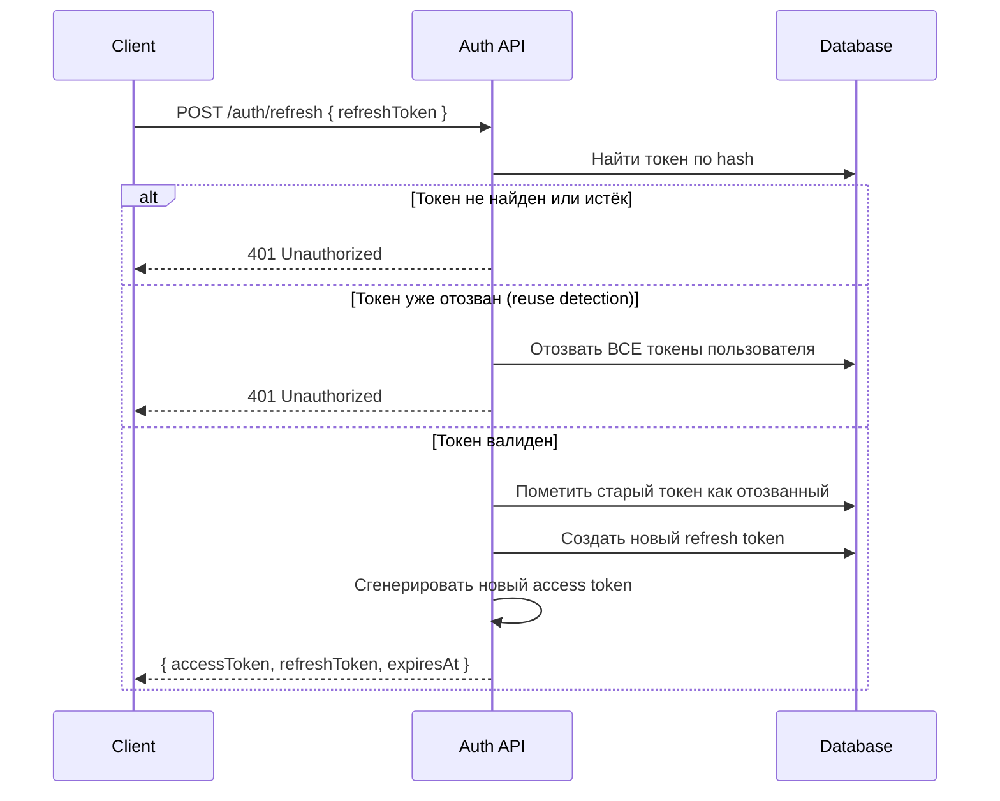
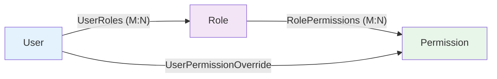

# 08. Безопасность

## Аутентификация

### JWT Bearer Tokens

| Параметр | Значение |
|----------|----------|
| Алгоритм | HMAC SHA256 |
| Access token TTL | 30 минут (настраивается) |
| Refresh token TTL | 7 дней (настраивается) |
| Clock skew | 30 секунд |
| Хранение (frontend) | localStorage |

### Claims в Access Token

```
sub          = UserId (Guid)
unique_name  = Username
email        = Email
jti          = JWT ID (Guid)
permission   = "users.read" (повторяющийся claim для каждого permission)
```

### Ротация Refresh Token



**Reuse Detection:** если кто-то попытается использовать уже отозванный refresh token, система отзывает **все** активные токены пользователя (защита от кражи токена).

### Хеширование паролей

- `PasswordHasher<User>` из ASP.NET Identity (PBKDF2, автоматический salt)

## Авторизация (RBAC + Permission Overrides)

### Модель прав



Эффективные права пользователя = (права всех его ролей) + (персональные allow) - (персональные deny).

### Полный список permissions (14 шт.)

| Группа | Код | Описание |
|--------|-----|----------|
| Users | `users.read` | Просмотр пользователей |
| Users | `users.create` | Создание пользователей |
| Users | `users.update` | Редактирование пользователей |
| Users | `users.delete` | Удаление пользователей |
| Roles | `roles.read` | Просмотр ролей |
| Roles | `roles.create` | Создание ролей |
| Roles | `roles.update` | Редактирование ролей |
| Roles | `roles.delete` | Удаление ролей |
| Permissions | `permissions.read` | Просмотр списка прав |
| Audit | `audit.read` | Просмотр аудит-лога |
| Clients | `clients.read` | Просмотр клиентов |
| Clients | `clients.create` | Создание клиентов |
| Clients | `clients.update` | Редактирование клиентов |
| Clients | `clients.delete` | Удаление клиентов |

### Механизм авторизации (Backend)

1. Контроллер помечен атрибутом `[HasPermission("users.read")]`
2. `PermissionPolicyProvider` создаёт динамическую policy для любого кода, содержащего `.`
3. `PermissionAuthorizationHandler` проверяет наличие claim `permission` со значением, совпадающим с требуемым кодом
4. При отсутствии -- 403 Forbidden

### Механизм авторизации (Frontend)

```typescript
const canDelete = useHasPermission("users.delete");
// ...
{canDelete && <DeleteButton />}
```

Пункты меню в MainLayout также фильтруются по permissions.

## Data Scopes (Row-Level Security)

Модель `DataScope` (userId, scopeType, scopeValue) подготовлена в домене, но **не реализована** на уровне query filtering. Это задел для будущей функциональности row-level security.

## Защита системных ролей

Роли с `IsSystem = true`:
- Нельзя изменить (UpdateRoleCommand проверяет)
- Нельзя удалить (DeleteRoleCommand проверяет)

## Известные ограничения

| Ограничение | Описание | Рекомендация |
|-------------|----------|--------------|
| localStorage для токенов | XSS-уязвимость: скрипт может украсть токены | Рассмотреть httpOnly cookies |
| Нет rate limiting | Эндпоинт логина не защищён от brute force | Добавить rate limiter (AspNetCoreRateLimit) |
| Нет HTTPS в Docker | Compose работает по HTTP | Для production: TLS termination на reverse proxy |
| Нет CSP заголовков | Content Security Policy не настроен | Добавить CSP в nginx.conf |
| CORS настройка | Разрешены только localhost:5173 и localhost:3000 | Обновить для production |
