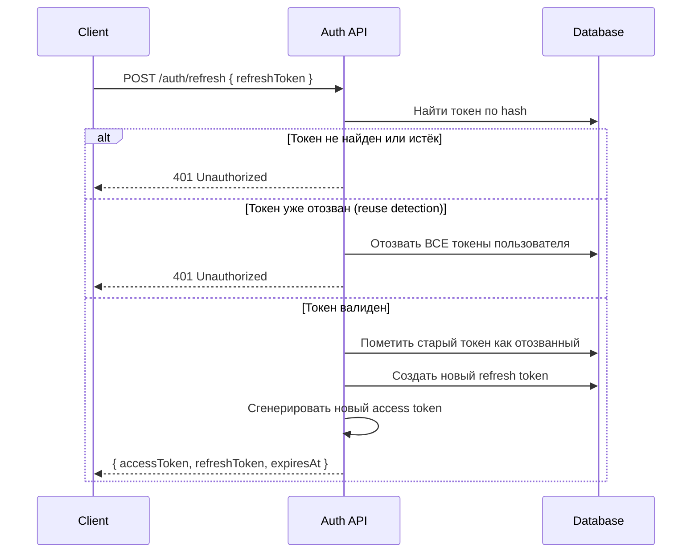
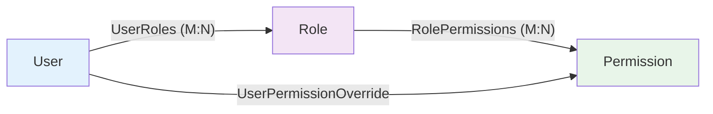

# 08. Безопасность

## Аутентификация

> JWT-выдача (login, refresh) выполняется **auth-service**. JWT-валидация выполняется **локально** в каждом сервисе (проверка подписи + claims, без roundtrip к auth-service). Оба сервиса используют общий JWT secret.

### JWT Bearer Tokens

| Параметр | Значение |
|----------|----------|
| Алгоритм | HMAC SHA256 |
| Access token TTL | 30 минут (настраивается) |
| Refresh token TTL | 7 дней (настраивается) |
| Clock skew | 30 секунд |
| Хранение (frontend) | localStorage |
| Выдача | auth-service |
| Валидация | Локально в каждом сервисе (claim check) |

### Claims в Access Token

```
sub          = UserId (Guid)
unique_name  = Username
email        = Email
jti          = JWT ID (Guid)
permission   = "users.read" (повторяющийся claim для каждого permission)
```

### Ротация Refresh Token


```mermaid
sequenceDiagram
    participant C as Client
    participant API as Auth API
    participant DB as Database

    C->>API: POST /auth/refresh { refreshToken }
    API->>DB: Найти токен по hash
    alt Токен не найден или истёк
        API-->>C: 401 Unauthorized
    else Токен уже отозван (reuse detection)
        API->>DB: Отозвать ВСЕ токены пользователя
        API-->>C: 401 Unauthorized
    else Токен валиден
        API->>DB: Пометить старый токен как отозванный
        API->>DB: Создать новый refresh token
        API->>API: Сгенерировать новый access token
        API-->>C: { accessToken, refreshToken, expiresAt }
    end
```

**Reuse Detection:** если кто-то попытается использовать уже отозванный refresh token, система отзывает **все** активные токены пользователя (защита от кражи токена).

### Хеширование паролей

- `PasswordHasher<User>` из ASP.NET Identity (PBKDF2, автоматический salt)

## Авторизация (RBAC + Permission Overrides)

### Модель прав


```mermaid
flowchart LR
    User -->|"UserRoles (M:N)"| Role
    Role -->|"RolePermissions (M:N)"| Permission
    User -->|"UserPermissionOverride"| Permission

    style User fill:#e3f2fd
    style Role fill:#f3e5f5
    style Permission fill:#e8f5e9
```

Эффективные права пользователя = (права всех его ролей) + (персональные allow) - (персональные deny).

### Полный список permissions

| Группа | Код | Описание |
|--------|-----|----------|
| Users | `users.read` | Просмотр пользователей |
| Users | `users.create` | Создание пользователей |
| Users | `users.update` | Редактирование пользователей |
| Users | `users.delete` | Удаление пользователей |
| Roles | `roles.read` | Просмотр ролей |
| Roles | `roles.create` | Создание ролей |
| Roles | `roles.update` | Редактирование ролей |
| Roles | `roles.delete` | Удаление ролей |
| Permissions | `permissions.read` | Просмотр списка прав |
| Audit | `audit.read` | Просмотр аудит-лога |
| Clients | `clients.read` | Просмотр клиентов |
| Clients | `clients.create` | Создание клиентов |
| Clients | `clients.update` | Редактирование клиентов |
| Clients | `clients.delete` | Удаление клиентов |
| Accounts | `accounts.read` | Просмотр счетов |
| Accounts | `accounts.create` | Создание счетов |
| Accounts | `accounts.update` | Редактирование счетов |
| Accounts | `accounts.delete` | Удаление счетов |
| Instruments | `instruments.read` | Просмотр инструментов |
| Instruments | `instruments.create` | Создание инструментов |
| Instruments | `instruments.update` | Редактирование инструментов |
| Instruments | `instruments.delete` | Удаление инструментов |
| Orders | `orders.read` | Просмотр поручений |
| Orders | `orders.create` | Создание поручений |
| Orders | `orders.update` | Редактирование поручений |
| Orders | `orders.delete` | Удаление поручений |
| Transactions | `transactions.read` | Просмотр транзакций |
| Transactions | `transactions.create` | Создание транзакций |
| Transactions | `transactions.update` | Редактирование транзакций |
| Transactions | `transactions.delete` | Удаление транзакций |
| Settings | `settings.manage` | Управление справочниками (Clearers, Trade Platforms, Exchanges, Currencies) |

### Механизм авторизации (Backend)

1. Контроллер помечен атрибутом `[HasPermission("users.read")]`
2. `PermissionPolicyProvider` создаёт динамическую policy для любого кода, содержащего `.`
3. `PermissionAuthorizationHandler` проверяет наличие claim `permission` со значением, совпадающим с требуемым кодом
4. При отсутствии -- 403 Forbidden

> **Примечание:** `Permissions.cs` (строковые константы всех 31 прав) дублируется в обоих сервисах (auth-service и монолит). Механизм авторизации одинаков в обоих сервисах.

### Механизм авторизации (Frontend)

```typescript
const canDelete = useHasPermission("users.delete");
// ...
{canDelete && <DeleteButton />}
```

Пункты меню в MainLayout также фильтруются по permissions.

## Data Scopes (Row-Level Security)

Модель `DataScope` (userId, scopeType, scopeValue) подготовлена в домене, но **не реализована** на уровне query filtering. Это задел для будущей функциональности row-level security.

## Защита системных ролей

Роли с `IsSystem = true`:
- Нельзя изменить (UpdateRoleCommand проверяет)
- Нельзя удалить (DeleteRoleCommand проверяет)

## Меры защиты

| Мера | Описание |
|------|----------|
| Rate limiting | ASP.NET Core built-in: `login` (5 req/мин), `auth` (20 req/мин), `sensitive` (5 req/5 мин) — на эндпоинтах AuthController |
| CSP заголовки | Настроены в nginx.conf: `default-src 'self'`, `style-src 'self' 'unsafe-inline'` (MUI), `img-src 'self' data: blob:`, `frame-ancestors 'none'` |
| Security headers | `X-Content-Type-Options: nosniff`, `X-Frame-Options: DENY`, `X-XSS-Protection`, `Referrer-Policy`, `Permissions-Policy`, `server_tokens off` |
| HSTS | `Strict-Transport-Security: max-age=63072000; includeSubDomains` |
| Контейнер web | Nginx работает как non-root пользователь на порту 8080 |

## Известные ограничения

| Ограничение | Описание | Рекомендация |
|-------------|----------|--------------|
| localStorage для токенов | XSS-уязвимость: скрипт может украсть токены | Рассмотреть httpOnly cookies |
| Нет HTTPS в Docker | Compose работает по HTTP | Для production: TLS termination на reverse proxy |
| CORS настройка | Разрешены только localhost origins | Обновить для production |
