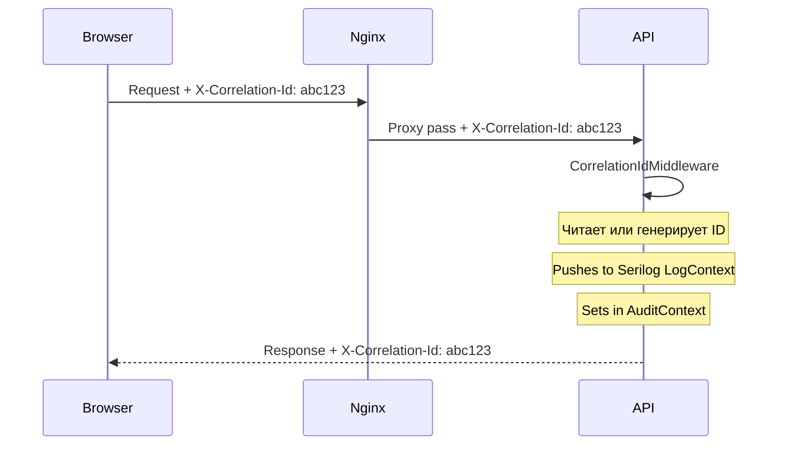

# 09. Наблюдаемость

## Логирование

### Backend (Serilog)

**Конфигурация:**
- Уровень по умолчанию: `Information`
- Microsoft.AspNetCore: `Warning`
- Microsoft.EntityFrameworkCore: `Warning`

**Формат вывода:**
```
[HH:mm:ss LVL] [CorrelationId] Message
```

**Обогащение (Enrichment):**
- `CorrelationId` -- из HTTP-заголовка `X-Correlation-Id` (или генерируется автоматически)
- Доступен через `Serilog.Context.LogContext`

### Correlation ID



Frontend генерирует `X-Correlation-Id` (UUID без дефисов) в Axios request interceptor. Backend читает его или генерирует свой.

### Frontend

Логирование в браузере -- стандартный `console.*`. Нет интеграции с внешними сервисами (Sentry, LogRocket и т.п.).

## Health Checks

| Эндпоинт | Назначение | Проверка |
|----------|------------|----------|
| `/health/live` | Liveness probe | Всегда 200 (приложение запущено) |
| `/health/ready` | Readiness probe | Подключение к SQL Server |

### Docker Health Checks

| Контейнер | Механизм | Параметры |
|-----------|----------|-----------|
| mssql | `sqlcmd SELECT 1` | interval: 10s, timeout: 5s, retries: 5, start: 30s |
| api | TCP check :8080 | interval: 10s, timeout: 5s, retries: 5, start: 20s |
| web | `wget http://127.0.0.1:80/` | interval: 10s, timeout: 5s, retries: 3, start: 5s |

## Аудит как наблюдаемость

### HTTP-аудит (AuditLog)

`AuditLog` служит дополнительным инструментом наблюдаемости:
- Записываются все POST/PUT/PATCH/DELETE операции
- Содержат before/after JSON (до 16 KB)
- Привязаны к CorrelationId
- Имеют StatusCode и IsSuccess
- Доступны через UI (страница Audit Log с фильтрами)

### Поле-уровневый аудит (EntityChanges)

`EntityChanges` обеспечивает детальное отслеживание на уровне отдельных полей:
- Автоматический захват через override `SaveChangesAsync` в `AppDbContext`
- Записывает каждое изменённое поле: старое значение → новое значение
- FK-значения автоматически резолвятся в имена (CountryId → "Germany", ClearerId → "Apex Clearing")
- Группировка по OperationId (request-scoped) — все save в рамках одного запроса = одна операция
- Поддержка связанных сущностей: адреса, холдеры, инвест-профиль, роли, права
- Контекстные display names для сущностей ("Legal, 612 Oak Ave, Berlin", "Owner, Matthew Clark")
- ФИО пользователя вместо логина (из JWT claim `full_name`)
- Доступны через UI (кнопка History на страницах деталей) и API (`GET /api/v1/entity-changes`)

## Метрики и трейсинг

> **Не обнаружено.** Нет интеграции с:
> - Prometheus / Grafana (метрики)
> - OpenTelemetry / Jaeger (distributed tracing)
> - Application Insights / New Relic (APM)

## Рекомендации

### Краткосрочные

1. **Structured logging в JSON** для production (Serilog JSON sink)
2. **Sentry / аналог** на frontend для отлова ошибок
3. **Prometheus endpoint** (`/metrics`) с базовыми метриками ASP.NET

### Среднесрочные

4. **OpenTelemetry** для distributed tracing (HTTP, EF Core, custom spans)
5. **Grafana dashboard** для мониторинга API latency, error rate, DB query time
6. **Alerting** на критические ошибки (5xx rate, DB connection failures)
