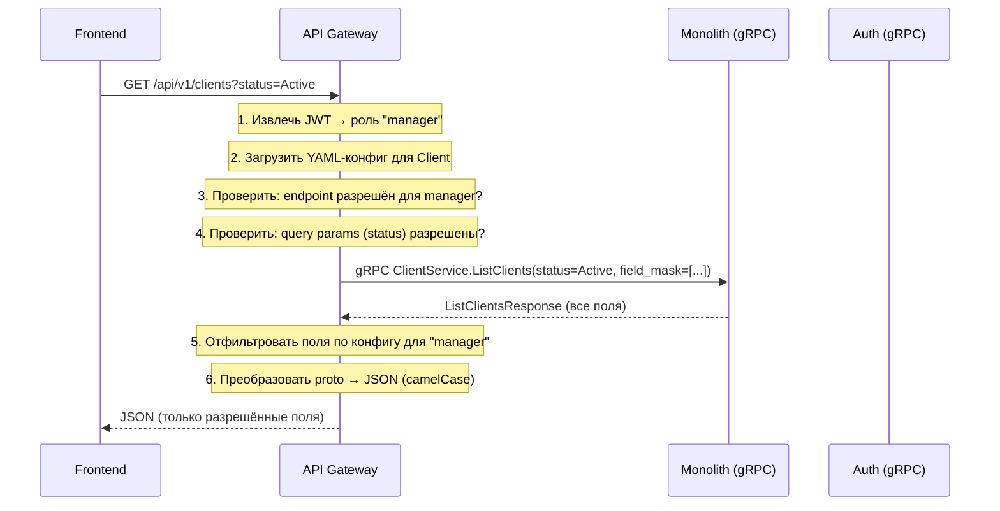
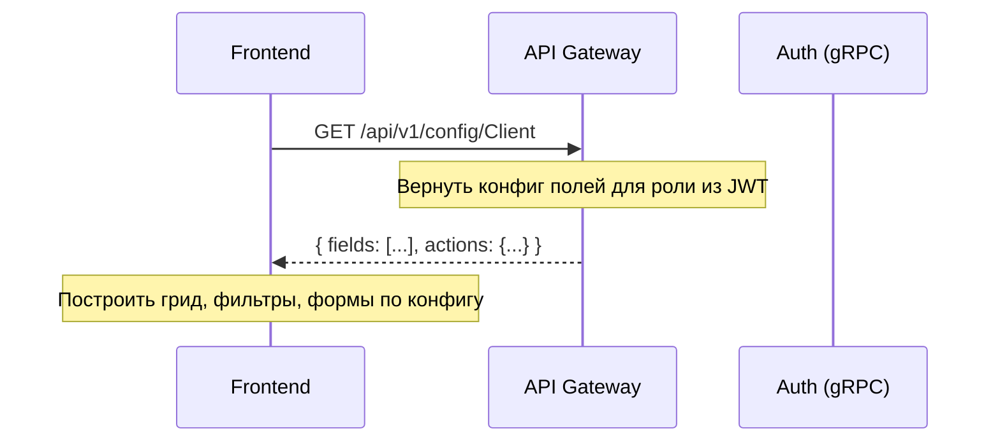

# 10. API Gateway (Config Service)

## Назначение

API Gateway -- центральный сервис-прослойка между внешними потребителями (Frontend, n8n, внешние интеграции) и внутренними сервисами (Monolith, Auth Service, будущие сервисы). Объединяет три ключевые функции:

1. **Конфигурация видимости** -- YAML-конфиг определяет какие сущности, поля, действия и эндпоинты доступны для каждой роли и каждого потребителя
2. **Protocol translation** -- принимает REST от внешних клиентов, вызывает внутренние сервисы по gRPC
3. **Field-level access control** -- фильтрует поля в ответах и запросах на основании конфигурации и роли текущего пользователя

### Зачем нужен

| Проблема | Решение через Gateway |
|----------|-----------------------|
| Фронтенд и n8n напрямую вызывают разные сервисы | Единая точка входа, один base URL |
| Нельзя скрыть поле/сущность без деплоя кода | YAML-конфиг: изменил -> перезагрузил -> готово |
| Разные роли должны видеть разные поля (PII, compliance) | Field-level RBAC на уровне gateway |
| Межсервисное взаимодействие по HTTP -- медленно | gRPC для внутренней коммуникации |
| nginx вручную маршрутизирует /api/ по сервисам | Gateway маршрутизирует автоматически из конфига |
| n8n нужен чистый Swagger для построения workflows | Gateway генерирует Swagger из конфига |
| Добавление нового сервиса требует правок nginx, docker-compose | Достаточно добавить upstream в YAML |

---

## Целевая архитектура

```
                         ┌──────────────────────────────────────────────┐
                         │              API Gateway (.NET 8)            │
                         │                                              │
  Frontend ──REST───────▶│  ┌──────────┐ ┌───────────┐ ┌────────────┐ │
                         │  │  YAML    │ │ REST→gRPC │ │  Swagger   │ │
  n8n      ──REST───────▶│  │  Config  │ │ Translate │ │ Generator  │ │
                         │  └──────────┘ └───────────┘ └────────────┘ │
  External ──REST───────▶│  ┌──────────┐ ┌───────────┐ ┌────────────┐ │
                         │  │  Field   │ │  Access   │ │  Admin UI  │ │
                         │  │  Filter  │ │  Control  │ │  (Blazor)  │ │
                         │  └──────────┘ └───────────┘ └────────────┘ │
                         └──────┬───────────────┬───────────────┬──────┘
                                │ gRPC          │ gRPC          │ gRPC
                                ▼               ▼               ▼
                         ┌───────────┐   ┌───────────┐   ┌───────────┐
                         │ Monolith  │   │   Auth    │   │  Future   │
                         │  :50051   │   │  :50052   │   │  Service  │
                         │ REST+gRPC │   │ REST+gRPC │   │   :5005N  │
                         └───────────┘   └───────────┘   └───────────┘
                                │               │
                                ▼               ▼
                         ┌────────────────────────────┐
                         │    PostgreSQL 16 (:5432)    │
                         │  public.* │ auth.*          │
                         └────────────────────────────┘
```

### Потоки данных





---

## Сетевая карта (целевая)

| Контейнер | Внешний порт | Внутренний порт | Протокол | Назначение |
|-----------|-------------|-----------------|----------|------------|
| broker-gateway | 8080 | 8080 | HTTP/REST | Единственная внешняя точка входа API |
| broker-gateway | 8081 | 8081 | HTTP | Admin UI (конфигурация) |
| broker-api | -- (не экспонируется) | 8080 + 50051 | REST + gRPC | Бизнес-логика |
| broker-auth | -- (не экспонируется) | 8082 + 50052 | REST + gRPC | Аутентификация, пользователи |
| broker-web | 3000 | 8080 | HTTP (nginx) | Frontend SPA |
| broker-postgres | 5432 | 5432 | TCP | База данных |
| broker-n8n | 5678 | 5678 | HTTP | Workflow automation |

> **Важно:** После внедрения Gateway монолит и auth-service перестают экспонировать HTTP-порты наружу. Весь внешний REST-трафик идёт через Gateway. REST-эндпоинты на backend-сервисах сохраняются на переходный период (Phase 1-3) и удаляются в Phase 5.

---

## Структура проекта

```
gateway/
├── Broker.Gateway.sln
├── Directory.Build.props               # .NET 8, strict mode
│
├── proto/                              # Shared proto definitions (git submodule или shared folder)
│   └── broker/v1/
│       ├── clients.proto
│       ├── accounts.proto
│       ├── instruments.proto
│       ├── orders.proto
│       ├── transactions.proto
│       ├── auth.proto
│       ├── users.proto
│       ├── roles.proto
│       ├── permissions.proto
│       ├── references.proto            # Clearers, Currencies, Exchanges, TradePlatforms
│       ├── audit.proto
│       ├── dashboard.proto
│       └── common.proto                # PagedRequest, PagedResponse, FieldMask, Timestamp
│
├── src/
│   ├── Broker.Gateway/                 # Основной проект Gateway
│   │   ├── Program.cs                  # Composition root
│   │   ├── Configuration/
│   │   │   ├── GatewayConfig.cs        # Типизированная модель YAML-конфига
│   │   │   ├── EntityConfig.cs         # Конфигурация сущности
│   │   │   ├── FieldConfig.cs          # Конфигурация поля
│   │   │   ├── UpstreamConfig.cs       # Конфигурация gRPC-upstream
│   │   │   ├── AccessProfileConfig.cs  # Профили доступа (frontend, n8n, external)
│   │   │   ├── ConfigLoader.cs         # Загрузка и hot-reload YAML
│   │   │   └── ConfigValidator.cs      # Валидация конфига при загрузке
│   │   │
│   │   ├── Routing/
│   │   │   ├── DynamicRouteBuilder.cs  # Построение REST-эндпоинтов из YAML
│   │   │   └── RouteMapping.cs         # REST path → gRPC method mapping
│   │   │
│   │   ├── Proxy/
│   │   │   ├── GrpcProxyMiddleware.cs  # REST → gRPC translation middleware
│   │   │   ├── RequestTranslator.cs    # JSON body → protobuf message
│   │   │   ├── ResponseTranslator.cs   # Protobuf message → JSON
│   │   │   ├── FieldFilter.cs          # Фильтрация полей по конфигу и роли
│   │   │   ├── QueryParamValidator.cs  # Валидация query params
│   │   │   └── FieldMaskBuilder.cs     # Построение gRPC FieldMask из конфига
│   │   │
│   │   ├── Auth/
│   │   │   ├── JwtMiddleware.cs        # Извлечение и валидация JWT
│   │   │   ├── AccessProfileResolver.cs # Определение профиля (frontend/n8n/external)
│   │   │   └── RoleResolver.cs         # Извлечение роли из JWT claims
│   │   │
│   │   ├── Swagger/
│   │   │   ├── DynamicSwaggerGenerator.cs   # Генерация OpenAPI spec из YAML
│   │   │   └── SwaggerFieldFilter.cs        # Фильтрация полей в Swagger по профилю
│   │   │
│   │   ├── HealthChecks/
│   │   │   ├── GrpcUpstreamHealthCheck.cs   # Проверка gRPC-подключений
│   │   │   └── ConfigHealthCheck.cs         # Валидность конфига
│   │   │
│   │   ├── Middleware/
│   │   │   ├── CorrelationIdMiddleware.cs
│   │   │   ├── ExceptionHandlingMiddleware.cs
│   │   │   └── RequestLoggingMiddleware.cs
│   │   │
│   │   └── appsettings.json
│   │
│   └── Broker.Gateway.Admin/          # Admin UI для редактирования конфига
│       ├── Pages/                      # Blazor Server pages
│       │   ├── EntitiesPage.razor      # Список сущностей + toggle enabled
│       │   ├── EntityFieldsPage.razor  # Настройка полей сущности
│       │   ├── AccessProfilesPage.razor # Профили доступа
│       │   ├── UpstreamsPage.razor     # gRPC-подключения + health status
│       │   └── ConfigDiffPage.razor    # История изменений конфига
│       └── Components/
│           ├── FieldEditor.razor       # Редактор одного поля
│           ├── YamlPreview.razor       # Превью YAML с подсветкой
│           └── ConfigValidation.razor  # Результаты валидации
│
├── config/
│   ├── gateway.yaml                    # Основной конфиг (entities, fields, access)
│   ├── upstreams.yaml                  # gRPC-подключения к сервисам
│   └── profiles.yaml                  # Профили доступа (frontend, n8n, external)
│
├── tests/
│   ├── Broker.Gateway.Tests.Unit/
│   │   ├── FieldFilterTests.cs
│   │   ├── ConfigLoaderTests.cs
│   │   ├── RequestTranslatorTests.cs
│   │   ├── ResponseTranslatorTests.cs
│   │   └── QueryParamValidatorTests.cs
│   └── Broker.Gateway.Tests.Integration/
│       ├── ProxyIntegrationTests.cs
│       ├── SwaggerGenerationTests.cs
│       └── AccessControlTests.cs
│
└── Dockerfile.gateway                  # Multi-stage .NET build
```

---

## YAML-конфигурация

### Структура конфига

Конфигурация разделена на три файла для удобства управления:

#### `config/upstreams.yaml` -- gRPC-подключения

```yaml
upstreams:
  monolith:
    address: broker-api:50051
    protos:
      - broker.v1.ClientService
      - broker.v1.AccountService
      - broker.v1.InstrumentService
      - broker.v1.TradeOrderService
      - broker.v1.NonTradeOrderService
      - broker.v1.TradeTransactionService
      - broker.v1.NonTradeTransactionService
      - broker.v1.ClearerService
      - broker.v1.CurrencyService
      - broker.v1.ExchangeService
      - broker.v1.TradePlatformService
      - broker.v1.DashboardService
      - broker.v1.AuditService
      - broker.v1.EntityChangeService
      - broker.v1.CountryService
    healthCheck:
      enabled: true
      intervalSeconds: 10
    timeout: 30s
    retryPolicy:
      maxRetries: 3
      backoff: exponential

  auth:
    address: broker-auth:50052
    protos:
      - broker.v1.AuthService
      - broker.v1.UserService
      - broker.v1.RoleService
      - broker.v1.PermissionService
    healthCheck:
      enabled: true
      intervalSeconds: 10
    timeout: 10s
    retryPolicy:
      maxRetries: 3
      backoff: exponential
```

#### `config/profiles.yaml` -- профили доступа

```yaml
profiles:
  frontend:
    description: "Браузер оператора, роль из JWT"
    auth: jwt
    roleSource: token_claims    # роль определяется из permission claims в JWT
    rateLimit:
      requestsPerMinute: 120
    cors:
      origins: ["http://localhost:3000"]

  n8n:
    description: "Workflow automation (n8n)"
    auth: basic                 # или api_key
    credentials:
      username: "${N8N_GATEWAY_USER:-n8n}"
      password: "${N8N_GATEWAY_PASSWORD}"
    role: service               # фиксированная роль, не из JWT
    rateLimit:
      requestsPerMinute: 200
    allowedEntities:            # можно ограничить доступные сущности
      - Client
      - Account
      - User

  external:
    description: "Внешние интеграции (API-ключ)"
    auth: api_key
    headerName: X-Api-Key
    role: external
    rateLimit:
      requestsPerMinute: 60
    allowedEntities:
      - Client
      - Account
```

#### `config/gateway.yaml` -- сущности и поля

```yaml
# Глобальные настройки
settings:
  defaultPageSize: 25
  maxPageSize: 10000
  enableAuditProxy: true        # прокси аудит-эндпоинтов

# Конфигурация сущностей
entities:
  Client:
    enabled: true
    upstream: monolith
    service: broker.v1.ClientService
    basePath: /api/v1/clients

    endpoints:
      list:
        method: GET
        path: /
        rpc: ListClients
        roles: [admin, manager, viewer, operator]
      get:
        method: GET
        path: /{id}
        rpc: GetClient
        roles: [admin, manager, viewer, operator]
      create:
        method: POST
        path: /
        rpc: CreateClient
        roles: [admin, manager]
      update:
        method: PUT
        path: /{id}
        rpc: UpdateClient
        roles: [admin, manager]
      delete:
        method: DELETE
        path: /{id}
        rpc: DeleteClient
        roles: [admin]

    fields:
      id:
        protoField: id
        restName: id
        type: uuid
        ui:
          grid: false
          detail: false
          form: false
        access:
          read: ["*"]
          write: []               # id никогда не редактируется

      clientType:
        protoField: client_type
        restName: clientType
        type: enum
        enumValues: [Individual, Corporate]
        ui:
          grid: true
          detail: true
          form: true
          gridOrder: 1
          section: General
          filterType: multiSelect
        access:
          read: ["*"]
          write: [admin, manager]
        validation:
          required: true

      firstName:
        protoField: first_name
        restName: firstName
        type: string
        ui:
          grid: true
          detail: true
          form: true
          gridOrder: 2
          section: General
          filterType: text
        access:
          read: ["*"]
          write: [admin, manager]
        validation:
          required: true
          maxLength: 100

      lastName:
        protoField: last_name
        restName: lastName
        type: string
        ui:
          grid: true
          detail: true
          form: true
          gridOrder: 3
          section: General
          filterType: text
        access:
          read: ["*"]
          write: [admin, manager]
        validation:
          required: true
          maxLength: 100

      email:
        protoField: email
        restName: email
        type: string
        ui:
          grid: true
          detail: true
          form: true
          gridOrder: 5
          section: Contact
          filterType: text
        access:
          read: ["*"]
          write: [admin, manager]
        validation:
          required: true
          format: email

      phone:
        protoField: phone
        restName: phone
        type: string
        ui:
          grid: true
          detail: true
          form: true
          gridOrder: 6
          section: Contact
          filterType: text
        access:
          read: [admin, manager, operator]
          write: [admin, manager]

      taxId:
        protoField: tax_id
        restName: taxId
        type: string
        ui:
          grid: false
          detail: true
          form: true
          section: Tax & Compliance
        access:
          read: [admin, compliance]       # только admin и compliance видят
          write: [admin]
        validation:
          pattern: "^\\d{3}-\\d{2}-\\d{4}$"

      pepStatus:
        protoField: pep_status
        restName: pepStatus
        type: boolean
        ui:
          grid: true
          detail: true
          form: true
          section: Tax & Compliance
          filterType: boolean
        access:
          read: [admin, compliance, manager]
          write: [admin, compliance]

      status:
        protoField: status
        restName: status
        type: enum
        enumValues: [Active, Blocked, Closed, Pending]
        ui:
          grid: true
          detail: true
          form: true
          gridOrder: 4
          section: General
          filterType: multiSelect
        access:
          read: ["*"]
          write: [admin, manager]

      residenceCountry:
        protoField: residence_country
        restName: residenceCountry
        type: reference
        referenceEntity: Country
        ui:
          grid: true
          detail: true
          form: true
          gridOrder: 7
          section: General
          filterType: multiSelect
        access:
          read: ["*"]
          write: [admin, manager]

      addresses:
        protoField: addresses
        restName: addresses
        type: array
        ui:
          grid: false
          detail: true
          form: true
          section: Addresses
        access:
          read: [admin, manager, operator]
          write: [admin, manager]
        fields:                           # вложенные поля
          street:
            protoField: street
            restName: street
            type: string
            access:
              read: [admin, manager, operator]
              write: [admin, manager]
          city:
            protoField: city
            restName: city
            type: string
            access:
              read: [admin, manager, operator]
              write: [admin, manager]
          zipCode:
            protoField: zip_code
            restName: zipCode
            type: string
            access:
              read: [admin, manager]      # operator не видит zip
              write: [admin, manager]

      investmentProfile:
        protoField: investment_profile
        restName: investmentProfile
        type: object
        ui:
          grid: false
          detail: true
          form: true
          section: Investment Profile
        access:
          read: [admin, manager]
          write: [admin]
        fields:
          annualIncome:
            protoField: annual_income
            restName: annualIncome
            type: decimal
            access:
              read: [admin]               # только admin видит доход
              write: [admin]
          riskTolerance:
            protoField: risk_tolerance
            restName: riskTolerance
            type: enum
            enumValues: [Low, Medium, High, Aggressive]
            access:
              read: [admin, manager]
              write: [admin]

      rowVersion:
        protoField: row_version
        restName: rowVersion
        type: uint
        ui:
          grid: false
          detail: false
          form: false                     # передаётся скрыто при update
        access:
          read: ["*"]
          write: ["*"]

      createdAt:
        protoField: created_at
        restName: createdAt
        type: datetime
        ui:
          grid: true
          detail: true
          form: false
          gridOrder: 99
          filterType: dateRange
        access:
          read: ["*"]
          write: []

  Account:
    enabled: true
    upstream: monolith
    service: broker.v1.AccountService
    basePath: /api/v1/accounts
    # ... аналогично Client

  User:
    enabled: true
    upstream: auth
    service: broker.v1.UserService
    basePath: /api/v1/users
    # ... аналогично

  # Пример полностью отключённой сущности
  InvestmentProfile:
    enabled: false                        # не доступна как отдельный endpoint
```

### Правила интерпретации конфига

| Поле конфига | Значение | Поведение |
|-------------|----------|-----------|
| `enabled: false` (сущность) | Сущность отключена | Endpoint не регистрируется, не попадает в Swagger |
| `enabled: false` (поле) | Поле отключено | Вырезается из response/request, не попадает в Swagger |
| `access.read: ["*"]` | Чтение для всех | Поле присутствует в response для любой роли |
| `access.read: [admin]` | Чтение только для admin | Для остальных ролей поле вырезается из response |
| `access.write: []` | Запись запрещена | Поле вырезается из request body, игнорируется при create/update |
| `ui.grid: false` | Не показывать в таблице | Frontend не рендерит колонку |
| `ui.form: false` | Не показывать в форме | Frontend не рендерит поле в диалогах create/edit |
| `validation.required: true` | Обязательное | Gateway валидирует до отправки в gRPC |
| `roles` (endpoint) | Разрешённые роли | 403 если роль не в списке |

---

## Технологический стек

### Gateway

| Компонент | Технология | Обоснование |
|-----------|-----------|-------------|
| Runtime | .NET 8, ASP.NET Core | Единый стек с backend, общие proto-файлы |
| gRPC Client | `Grpc.Net.Client` + `Google.Protobuf` | Нативная поддержка в .NET |
| YAML парсинг | `YamlDotNet` | Зрелая библиотека, типизированная десериализация |
| Hot reload | `IOptionsMonitor<T>` + `FileSystemWatcher` | Стандартный .NET паттерн |
| Swagger | `Swashbuckle` + кастомный `IDocumentFilter` | Динамическая генерация OpenAPI spec |
| Admin UI | Blazor Server | .NET без отдельного фронтенда, быстрая разработка |
| Health checks | `AspNetCore.Diagnostics.HealthChecks` + `Grpc.HealthCheck` | gRPC health protocol v1 |
| Logging | Serilog | Единообразно с остальными сервисами |
| Rate limiting | `AspNetCore.RateLimiting` | Встроенный, уже используется в auth |
| JWT валидация | `Microsoft.AspNetCore.Authentication.JwtBearer` | Единообразно с остальными сервисами |
| Тесты | xUnit, FluentAssertions, NSubstitute, Testcontainers | Единообразно с остальными сервисами |

### Shared Proto

| Компонент | Технология |
|-----------|-----------|
| Proto-файлы | `proto/broker/v1/*.proto` (Protocol Buffers v3) |
| Генерация C# | `Grpc.Tools` NuGet (build-time codegen) |
| Shared project | `Broker.Proto` -- общий .csproj с proto-файлами |

### Backend-сервисы (добавления)

| Компонент | Технология |
|-----------|-----------|
| gRPC Server | `Grpc.AspNetCore` NuGet |
| gRPC Services | ASP.NET Core gRPC services (`MapGrpcService<T>()`) |
| Dual protocol | Kestrel: HTTP/1.1 (REST) + HTTP/2 (gRPC) на разных портах |

---

## Proto-файлы (контракты)

Proto-файлы -- единый источник истины для модели данных. Описывают все сущности, все поля, все RPC-методы.

### Расположение

```
proto/
└── broker/v1/
    ├── common.proto          # Shared types: PagedRequest, PagedResponse, Money, Timestamp
    ├── clients.proto         # ClientService: ListClients, GetClient, CreateClient, ...
    ├── accounts.proto        # AccountService
    ├── instruments.proto     # InstrumentService
    ├── orders.proto          # TradeOrderService, NonTradeOrderService
    ├── transactions.proto    # TradeTransactionService, NonTradeTransactionService
    ├── auth.proto            # AuthService: Login, RefreshToken, GetMe, ChangePassword
    ├── users.proto           # UserService: ListUsers, GetUser, CreateUser, ...
    ├── roles.proto           # RoleService
    ├── permissions.proto     # PermissionService
    ├── references.proto      # ClearerService, CurrencyService, ExchangeService, TradePlatformService
    ├── audit.proto           # AuditService, EntityChangeService
    ├── dashboard.proto       # DashboardService
    └── countries.proto       # CountryService
```

### Пример: `common.proto`

```protobuf
syntax = "proto3";
package broker.v1;

import "google/protobuf/timestamp.proto";
import "google/protobuf/wrappers.proto";
import "google/protobuf/field_mask.proto";

// Пагинация (запрос)
message PagedRequest {
  int32 page = 1;
  int32 page_size = 2;
  string sort = 3;              // "fieldName asc" / "fieldName desc"
  string q = 4;                 // Глобальный поиск
}

// Пагинация (ответ)
message PagedMeta {
  int32 total_count = 1;
  int32 page = 2;
  int32 page_size = 3;
  int32 total_pages = 4;
}
```

### Пример: `clients.proto`

```protobuf
syntax = "proto3";
package broker.v1;

import "broker/v1/common.proto";
import "google/protobuf/timestamp.proto";
import "google/protobuf/wrappers.proto";
import "google/protobuf/field_mask.proto";
import "google/protobuf/empty.proto";

service ClientService {
  rpc ListClients(ListClientsRequest) returns (ListClientsResponse);
  rpc GetClient(GetClientRequest) returns (Client);
  rpc CreateClient(CreateClientRequest) returns (Client);
  rpc UpdateClient(UpdateClientRequest) returns (Client);
  rpc DeleteClient(DeleteClientRequest) returns (google.protobuf.Empty);
}

// ─── Messages ───────────────────────────────────────

enum ClientType {
  CLIENT_TYPE_UNSPECIFIED = 0;
  CLIENT_TYPE_INDIVIDUAL = 1;
  CLIENT_TYPE_CORPORATE = 2;
}

enum ClientStatus {
  CLIENT_STATUS_UNSPECIFIED = 0;
  CLIENT_STATUS_ACTIVE = 1;
  CLIENT_STATUS_BLOCKED = 2;
  CLIENT_STATUS_CLOSED = 3;
  CLIENT_STATUS_PENDING = 4;
}

enum KycStatus {
  KYC_STATUS_UNSPECIFIED = 0;
  KYC_STATUS_NOT_STARTED = 1;
  KYC_STATUS_IN_PROGRESS = 2;
  KYC_STATUS_VERIFIED = 3;
  KYC_STATUS_REJECTED = 4;
  KYC_STATUS_EXPIRED = 5;
}

enum RiskLevel {
  RISK_LEVEL_UNSPECIFIED = 0;
  RISK_LEVEL_LOW = 1;
  RISK_LEVEL_MEDIUM = 2;
  RISK_LEVEL_HIGH = 3;
  RISK_LEVEL_CRITICAL = 4;
}

message Country {
  string id = 1;
  string name = 2;
  string iso2 = 3;
  string iso3 = 4;
  string flag_emoji = 5;
}

message Address {
  string type = 1;
  string street = 2;
  string city = 3;
  string state = 4;
  string zip_code = 5;
  string country_id = 6;
  Country country = 7;
}

message InvestmentProfile {
  string experience_level = 1;
  string investment_objectives = 2;
  string risk_tolerance = 3;
  google.protobuf.DoubleValue annual_income = 4;
  google.protobuf.DoubleValue net_worth = 5;
  google.protobuf.DoubleValue liquid_net_worth = 6;
  string source_of_funds = 7;
}

message Client {
  string id = 1;
  ClientType client_type = 2;
  string first_name = 3;
  string last_name = 4;
  string company_name = 5;
  string email = 6;
  string phone = 7;
  string tax_id = 8;
  ClientStatus status = 9;
  KycStatus kyc_status = 10;
  bool pep_status = 11;
  RiskLevel risk_level = 12;
  string external_id = 13;
  Country residence_country = 14;
  Country citizenship_country = 15;
  repeated Address addresses = 16;
  InvestmentProfile investment_profile = 17;
  uint32 row_version = 18;
  google.protobuf.Timestamp created_at = 19;
  string created_by = 20;
  google.protobuf.Timestamp updated_at = 21;
  string updated_by = 22;
}

// ─── Requests / Responses ────────────────────────────

message ListClientsRequest {
  // Pagination
  int32 page = 1;
  int32 page_size = 2;
  string sort = 3;
  string q = 4;

  // Filters
  repeated ClientStatus status = 5;
  repeated ClientType client_type = 6;
  repeated KycStatus kyc_status = 7;
  repeated RiskLevel risk_level = 8;
  google.protobuf.BoolValue pep_status = 9;
  repeated string residence_country_ids = 10;
  repeated string citizenship_country_ids = 11;
  string name = 12;
  string email = 13;
  string phone = 14;
  string external_id = 15;
  google.protobuf.Timestamp created_from = 16;
  google.protobuf.Timestamp created_to = 17;

  // FieldMask — какие поля вернуть (пустой = все)
  google.protobuf.FieldMask field_mask = 20;
}

message ListClientsResponse {
  repeated Client items = 1;
  PagedMeta meta = 2;
}

message GetClientRequest {
  string id = 1;
  google.protobuf.FieldMask field_mask = 2;
}

message CreateClientRequest {
  ClientType client_type = 1;
  string first_name = 2;
  string last_name = 3;
  string company_name = 4;
  string email = 5;
  string phone = 6;
  string tax_id = 7;
  ClientStatus status = 8;
  KycStatus kyc_status = 9;
  bool pep_status = 10;
  RiskLevel risk_level = 11;
  string external_id = 12;
  string residence_country_id = 13;
  string citizenship_country_id = 14;
  repeated Address addresses = 15;
  InvestmentProfile investment_profile = 16;
}

message UpdateClientRequest {
  string id = 1;
  ClientType client_type = 2;
  string first_name = 3;
  string last_name = 4;
  string company_name = 5;
  string email = 6;
  string phone = 7;
  string tax_id = 8;
  ClientStatus status = 9;
  KycStatus kyc_status = 10;
  bool pep_status = 11;
  RiskLevel risk_level = 12;
  string external_id = 13;
  string residence_country_id = 14;
  string citizenship_country_id = 15;
  repeated Address addresses = 16;
  InvestmentProfile investment_profile = 17;
  uint32 row_version = 18;
}

message DeleteClientRequest {
  string id = 1;
}
```

---

## Ключевые компоненты Gateway

### 1. ConfigLoader — загрузка и hot-reload конфига

```
Startup:
  1. Загрузить gateway.yaml, upstreams.yaml, profiles.yaml
  2. Десериализовать в типизированные модели (GatewayConfig)
  3. Валидировать (ConfigValidator): все referenced entities/fields существуют,
     proto-fields корректны, нет циклических ссылок
  4. Зарегистрировать как IOptionsMonitor<GatewayConfig>

Hot-reload:
  - FileSystemWatcher отслеживает изменения YAML-файлов
  - При изменении: перезагрузить → валидировать → если ОК → применить
  - Если валидация провалилась — сохранить старый конфиг, залогировать ошибку
  - Endpoint: POST /admin/config/reload (ручной reload)
```

### 2. DynamicRouteBuilder — регистрация REST-эндпоинтов

```
При старте (и при hot-reload конфига):
  1. Для каждой enabled entity в конфиге:
     - Зарегистрировать REST-эндпоинты из entity.endpoints
     - Каждый endpoint → middleware pipeline:
       JwtAuth → AccessControl → QueryValidation → GrpcProxy → FieldFilter → Response
  2. Зарегистрировать metadata-эндпоинты:
     - GET /api/v1/config/{entityType} — конфиг полей для роли из JWT
     - GET /api/v1/config — список доступных сущностей
```

### 3. GrpcProxyMiddleware — translation REST → gRPC

```
Incoming REST request:
  1. Resolve entity config по URL path
  2. Resolve gRPC upstream (address, service, method)
  3. Создать gRPC channel (с connection pooling)
  4. Map REST → gRPC:
     - Route params ({id}) → proto message fields
     - Query params (?status=Active) → proto filter fields
     - Request body (JSON) → proto message (via JsonParser)
     - Построить FieldMask из конфига (запрашивать только разрешённые поля)
  5. Вызвать gRPC method
  6. Map gRPC → REST:
     - Proto message → JSON (via JsonFormatter, camelCase)
     - gRPC status codes → HTTP status codes
     - Apply FieldFilter (удалить поля, недоступные для роли)
  7. Вернуть JSON response
```

### 4. FieldFilter — фильтрация полей

```
Вход: JSON object + role + entity config
Выход: JSON object с удалёнными полями

Алгоритм:
  1. Для каждого поля в JSON:
     a. Найти field config
     b. Если field config не найден — удалить (неизвестное поле)
     c. Если field.enabled == false — удалить
     d. Если role не в field.access.read — удалить
     e. Если поле type == object или array — рекурсивно фильтровать вложенные
  2. Для write (request body):
     a. Аналогично, но проверять field.access.write
     b. Удалить read-only поля
```

### 5. Swagger Generator

```
При старте (и при hot-reload):
  1. Для каждой enabled entity:
     a. Создать schema из field configs (type, required, enum values)
     b. Создать path items из endpoint configs
     c. Фильтровать по текущему профилю (frontend видит одно, n8n другое)
  2. Собрать OpenAPI 3.0 spec
  3. Сервировать на GET /swagger/v1/swagger.json

Swagger endpoint принимает query param ?profile=frontend|n8n|external
для генерации spec под конкретного потребителя.
```

### 6. Config Metadata API

Frontend запрашивает конфиг перед рендерингом:

```
GET /api/v1/config/Client
Authorization: Bearer <jwt>

Response (для роли "manager"):
{
  "entityType": "Client",
  "basePath": "/api/v1/clients",
  "actions": {
    "create": true,
    "update": true,
    "delete": false,
    "export": true
  },
  "fields": [
    {
      "code": "firstName",
      "type": "string",
      "label": "First Name",
      "ui": { "grid": true, "detail": true, "form": true, "gridOrder": 2, "section": "General", "filterType": "text" },
      "writable": true,
      "validation": { "required": true, "maxLength": 100 }
    },
    {
      "code": "taxId",
      "type": "string",
      "label": "Tax ID",
      "ui": { "grid": false, "detail": false, "form": false },
      "writable": false,
      "validation": null
    }
    // taxId.detail = false для manager, т.к. access.read не включает manager
    // ...
  ],
  "sections": ["General", "Contact", "Tax & Compliance", "Addresses", "Investment Profile"]
}
```

Frontend использует этот ответ для:
- Построения колонок DataGrid (`ui.grid == true`)
- Построения фильтров (`ui.filterType`)
- Построения форм create/edit (`ui.form == true`, `writable == true`)
- Построения detail page (`ui.detail == true`, секционирование по `section`)
- Показа/скрытия кнопок действий (`actions.*`)

---

## Маппинг gRPC status → HTTP status

| gRPC Status | HTTP Status | Описание |
|-------------|-------------|----------|
| OK | 200 / 201 / 204 | Успех (201 для Create, 204 для Delete) |
| NOT_FOUND | 404 | Сущность не найдена |
| INVALID_ARGUMENT | 400 | Ошибка валидации |
| ALREADY_EXISTS | 409 | Дубликат (уникальность) |
| FAILED_PRECONDITION | 409 | Бизнес-правило / concurrency conflict |
| PERMISSION_DENIED | 403 | Нет прав |
| UNAUTHENTICATED | 401 | Не авторизован |
| RESOURCE_EXHAUSTED | 429 | Rate limit |
| INTERNAL | 500 | Внутренняя ошибка |
| UNAVAILABLE | 503 | Сервис недоступен |

Gateway преобразует gRPC-ошибки в RFC 7807 ProblemDetails (единообразно с текущим API).

---

## Взаимодействие с Frontend

### Текущее состояние

```
Frontend → nginx → auth-service (REST)
Frontend → nginx → monolith (REST)
```

### Целевое состояние

```
Frontend → nginx → Gateway (REST) → auth-service (gRPC)
Frontend → nginx → Gateway (REST) → monolith (gRPC)
Frontend → Gateway: GET /api/v1/config/{entity} — metadata для рендеринга
```

### Изменения во Frontend

1. **Base URL** -- не меняется (`/api/v1`), nginx перенаправляет на Gateway вместо backend-сервисов
2. **Новый API-хук** -- `useEntityConfig(entityType)` — загрузка метаданных полей
3. **Динамический DataGrid** -- колонки, фильтры, сортировка из конфига, а не из hardcoded `columns[]`
4. **Динамические формы** -- поля create/edit диалогов из конфига
5. **Динамический detail page** -- секции и поля из конфига
6. **Action visibility** -- кнопки create/edit/delete из `actions` конфига (дополнение к permission-based gating)

> **Обратная совместимость:** Фронтенд может работать и без Gateway — если `/api/v1/config/*` вернул 404, используются hardcoded columns/fields (fallback). Это обеспечивает плавную миграцию.

---

## Взаимодействие с n8n

### Текущее состояние

```
n8n → monolith (REST, http://api:8080/api/v1)
n8n → auth-service (REST, http://auth:8082/api/v1)
```

### Целевое состояние

```
n8n → Gateway (REST, http://gateway:8080/api/v1)
```

n8n получает:
- Единый base URL вместо двух
- Swagger, отфильтрованный под профиль `n8n` (только разрешённые сущности и поля)
- Rate limiting, отдельный от frontend
- Basic auth или API key (не JWT)

---

## Docker Compose (целевой)

```yaml
services:
  postgres:
    image: postgres:16-alpine
    # ... без изменений

  auth:
    build:
      context: .
      dockerfile: Dockerfile.auth
    container_name: broker-auth
    # Больше НЕ экспонирует порт наружу
    expose:
      - "8082"          # REST (переходный период)
      - "50052"         # gRPC
    environment:
      ASPNETCORE_URLS: "http://+:8082;http://+:50052"
      Kestrel__Endpoints__Rest__Url: "http://+:8082"
      Kestrel__Endpoints__Rest__Protocols: Http1
      Kestrel__Endpoints__Grpc__Url: "http://+:50052"
      Kestrel__Endpoints__Grpc__Protocols: Http2
      # ... остальные env vars
    depends_on:
      postgres:
        condition: service_healthy

  api:
    build:
      context: .
      dockerfile: Dockerfile.api
    container_name: broker-api
    # Больше НЕ экспонирует порт наружу
    expose:
      - "8080"          # REST (переходный период)
      - "50051"         # gRPC
    environment:
      ASPNETCORE_URLS: "http://+:8080;http://+:50051"
      Kestrel__Endpoints__Rest__Url: "http://+:8080"
      Kestrel__Endpoints__Rest__Protocols: Http1
      Kestrel__Endpoints__Grpc__Url: "http://+:50051"
      Kestrel__Endpoints__Grpc__Protocols: Http2
      # ... остальные env vars
    depends_on:
      postgres:
        condition: service_healthy
      auth:
        condition: service_healthy

  gateway:
    build:
      context: .
      dockerfile: Dockerfile.gateway
    container_name: broker-gateway
    restart: unless-stopped
    ports:
      - "8080:8080"     # REST API (единственная внешняя точка API)
      - "8081:8081"     # Admin UI
    environment:
      ASPNETCORE_ENVIRONMENT: "${ASPNETCORE_ENVIRONMENT:-Production}"
      Jwt__Secret: "${JWT_SECRET}"
      Gateway__ConfigPath: "/etc/gateway/config"
    volumes:
      - ./config:/etc/gateway/config:ro
    depends_on:
      api:
        condition: service_healthy
      auth:
        condition: service_healthy
    healthcheck:
      test: ["CMD-SHELL", "wget -qO /dev/null http://127.0.0.1:8080/health/live || exit 1"]
      interval: 10s
      timeout: 5s
      retries: 5
      start_period: 10s
    deploy:
      resources:
        limits:
          memory: 256M

  web:
    build:
      context: .
      dockerfile: Dockerfile.web
    container_name: broker-web
    ports:
      - "3000:8080"
    depends_on:
      gateway:
        condition: service_healthy
    # nginx.conf обновлён: /api/* → gateway:8080

  n8n:
    environment:
      BROKER_API_URL: "http://gateway:8080/api/v1"    # один URL вместо двух
    depends_on:
      gateway:
        condition: service_healthy
```

---

## План реализации

### Phase 1: Proto-файлы и shared project

**Цель:** Определить gRPC-контракты для всех сущностей.

**Задачи:**
1. Создать директорию `proto/broker/v1/` в корне репозитория
2. Написать proto-файлы для всех сущностей (clients, accounts, instruments, orders, transactions, auth, users, roles, permissions, references, audit, dashboard, countries)
3. Создать shared проект `Broker.Proto/Broker.Proto.csproj` с `Grpc.Tools` для кодогенерации
4. Подключить `Broker.Proto` как зависимость к backend и auth-service
5. Убедиться что proto messages покрывают все поля текущих DTO

**Результат:** Скомпилированные C# классы из proto, доступные всем проектам.

---

### Phase 2: gRPC-сервисы в Monolith и Auth

**Цель:** Backend-сервисы начинают обслуживать gRPC-запросы параллельно с REST.

**Задачи:**
1. Добавить `Grpc.AspNetCore` NuGet в оба сервиса
2. Настроить Kestrel dual-protocol (HTTP/1.1 + HTTP/2 на разных портах)
3. Реализовать gRPC service implementations:
   - `ClientGrpcService : ClientService.ClientServiceBase` — делегирует в MediatR handlers
   - Аналогично для всех остальных сервисов
4. Зарегистрировать gRPC-сервисы: `app.MapGrpcService<ClientGrpcService>()`
5. Добавить gRPC health check service (`Grpc.HealthCheck`)
6. Обновить docker-compose: expose gRPC-порты
7. Интеграционные тесты для gRPC-эндпоинтов

**Паттерн gRPC service:**
```csharp
public sealed class ClientGrpcService(ISender mediator) : ClientService.ClientServiceBase
{
    public override async Task<ListClientsResponse> ListClients(
        ListClientsRequest request, ServerCallContext context)
    {
        var query = MapToQuery(request);       // proto → MediatR query
        var result = await mediator.Send(query, context.CancellationToken);
        return MapToResponse(result);           // PagedResult<DTO> → proto response
    }
}
```

> gRPC-сервисы — тонкие адаптеры. Вся бизнес-логика остаётся в MediatR handlers.

**Результат:** Монолит и Auth обслуживают REST + gRPC одновременно. Внешний API не затронут.

---

### Phase 3: Gateway MVP (без field filtering)

**Цель:** Gateway принимает REST, вызывает gRPC, возвращает JSON. Без фильтрации полей.

**Задачи:**
1. Создать проект `gateway/Broker.Gateway/`
2. Реализовать `ConfigLoader` — чтение YAML-файлов
3. Реализовать `DynamicRouteBuilder` — регистрация REST-эндпоинтов из конфига
4. Реализовать `GrpcProxyMiddleware` — REST→gRPC→REST translation
5. Реализовать `RequestTranslator` (JSON→proto) и `ResponseTranslator` (proto→JSON)
6. JWT-валидация (копия текущей конфигурации из backend)
7. Маппинг gRPC status → HTTP status + ProblemDetails
8. Health checks (gRPC upstream connectivity)
9. Swagger generation из YAML-конфига
10. Обновить docker-compose: добавить gateway service
11. Обновить nginx: `/api/*` → gateway вместо backend-сервисов
12. Переключить n8n на gateway URL
13. Интеграционные тесты: REST→Gateway→gRPC→Backend roundtrip

**Результат:** Все REST-запросы идут через Gateway. Backend-сервисы не экспонируют порты наружу.

---

### Phase 4: Field Filtering + Access Control

**Цель:** Gateway фильтрует поля в запросах и ответах на основании YAML-конфига и роли.

**Задачи:**
1. Реализовать `FieldFilter` — фильтрация JSON-полей по роли
2. Реализовать `FieldMaskBuilder` — построение gRPC FieldMask из конфига
3. Реализовать `QueryParamValidator` — проверка query params против конфига
4. Реализовать endpoint-level access control (roles в endpoint config)
5. Реализовать Config Metadata API (`GET /api/v1/config/{entity}`)
6. Реализовать access profiles (frontend, n8n, external)
7. Реализовать валидацию request body по конфигу (required, pattern, maxLength)
8. Hot-reload конфига без рестарта (`FileSystemWatcher` + `IOptionsMonitor`)
9. Написать YAML-конфиг для всех текущих сущностей
10. Unit-тесты на FieldFilter, QueryParamValidator
11. Integration-тесты: проверить field-level filtering для разных ролей

**Результат:** Поля фильтруются по ролям. Frontend может запрашивать метаданные.

---

### Phase 5: Admin UI

**Цель:** Веб-интерфейс для управления YAML-конфигурацией.

**Задачи:**
1. Создать Blazor Server проект `Broker.Gateway.Admin`
2. Страницы:
   - Список сущностей (toggle enabled, overview)
   - Настройка полей сущности (grid с toggle visibility, access roles, validation)
   - Настройка endpoints (toggle, roles)
   - Профили доступа (CRUD)
   - gRPC upstreams (статус подключений, health)
   - Diff/история изменений конфига
3. YAML-превью с подсветкой синтаксиса
4. Валидация конфига перед сохранением
5. Кнопка "Apply" — сохранить YAML + trigger hot-reload
6. Аутентификация: Basic Auth (admin-only)

**Результат:** Конфигурация управляется через UI без редактирования YAML вручную.

---

### Phase 6: Frontend — динамический рендеринг

**Цель:** Frontend строит UI из metadata конфига вместо hardcoded columns/fields.

**Задачи:**
1. Новый хук `useEntityConfig(entityType)` — загрузка и кэширование метаданных
2. Компонент `DynamicDataGrid` — строит колонки и фильтры из конфига
3. Компонент `DynamicForm` — строит поля формы из конфига (create/edit dialogs)
4. Компонент `DynamicDetail` — строит секции detail page из конфига
5. Fallback на hardcoded layout если `/config/{entity}` недоступен
6. Обновить все страницы для использования динамического рендеринга

**Результат:** UI полностью управляется конфигурацией. Изменение YAML → изменение UI.

---

### Phase 7: Удаление REST из backend-сервисов

**Цель:** Backend-сервисы обслуживают только gRPC. REST полностью в Gateway.

**Задачи:**
1. Удалить Controllers из монолита и auth-service
2. Удалить REST middleware (ExceptionHandling → gRPC interceptors)
3. Удалить Swagger из backend-сервисов
4. Удалить REST-специфичные NuGet (Asp.Versioning, Swashbuckle)
5. Оставить только gRPC services + MediatR handlers
6. Обновить health checks (gRPC health protocol)
7. Обновить интеграционные тесты (gRPC client вместо HTTP client)
8. Обновить CI pipeline

**Результат:** Чистое разделение: Gateway = REST, Backend = gRPC + бизнес-логика.

---

## Диаграмма зависимостей проектов (целевая)

```
┌──────────────────────────────────────────────────────────────┐
│                         proto/                                │
│  Broker.Proto (.csproj)                                      │
│  Содержит: *.proto файлы + Grpc.Tools codegen                │
└──────────┬──────────────────┬──────────────────┬─────────────┘
           │                  │                  │
           ▼                  ▼                  ▼
┌──────────────────┐ ┌──────────────────┐ ┌──────────────────┐
│  gateway/        │ │  backend/        │ │  auth-service/   │
│  Broker.Gateway  │ │  Infrastructure  │ │  Infrastructure  │
│                  │ │  (gRPC services) │ │  (gRPC services) │
│  References:     │ │                  │ │                  │
│  - Broker.Proto  │ │  References:     │ │  References:     │
│  - YamlDotNet    │ │  - Broker.Proto  │ │  - Broker.Proto  │
│  - Grpc.Net.Client│ │  - Grpc.AspNetCore│ │  - Grpc.AspNetCore│
└──────────────────┘ └──────────────────┘ └──────────────────┘
```

---

## Риски и митигация

| Риск | Вероятность | Влияние | Митигация |
|------|------------|---------|-----------|
| Gateway как single point of failure | Высокая | Критичное | Health checks + restart policy + горизонтальное масштабирование (несколько реплик) |
| Задержка из-за дополнительного hop | Средняя | Среднее | gRPC binary protocol компенсирует; connection pooling; кэширование конфига в памяти |
| Сложность отладки (запрос проходит через 3 сервиса) | Средняя | Среднее | Correlation ID сквозной; structured logging; distributed tracing (OpenTelemetry) |
| Рассинхронизация proto и YAML-конфига | Средняя | Среднее | ConfigValidator проверяет proto-поля при загрузке; CI-проверка |
| YAML-конфиг становится слишком большим | Низкая | Низкое | Разбиение на файлы по сущностям; Admin UI абстрагирует сложность |
| Breaking changes в proto | Средняя | Высокое | Proto style guide: поля никогда не удалять, только deprecate; CI-линтер `buf lint` |

---

## Метрики успеха

| Метрика | Текущее | Целевое |
|---------|---------|---------|
| Внешних точек входа API | 2 (auth:8082, api:5050) | 1 (gateway:8080) |
| Время добавления нового сервиса | Правка nginx + docker-compose | Добавить upstream в YAML |
| Время скрытия/показа поля | Deploy (код + build + restart) | Правка YAML (hot-reload, ~1 сек) |
| Межсервисный протокол | HTTP/REST (text JSON) | gRPC (binary protobuf) |
| Swagger для n8n | Ручная настройка двух URL | Авто-генерация из конфига |
| Field-level access control | Нет | YAML-конфигурируемый по ролям |
